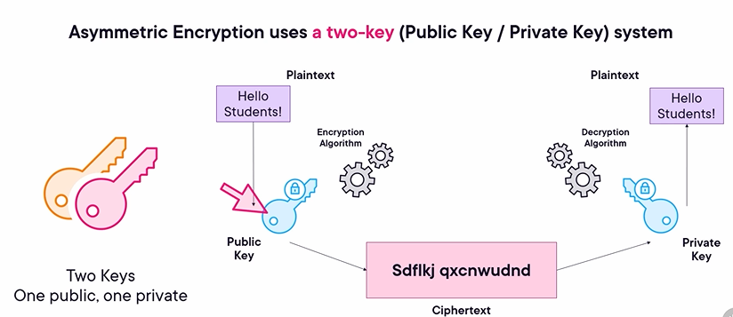
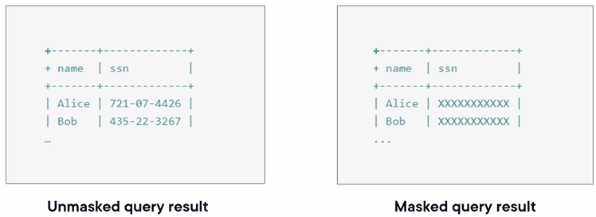
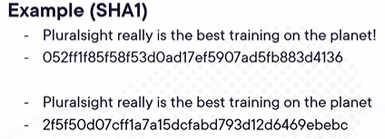
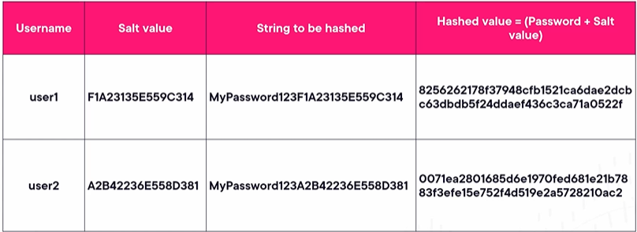
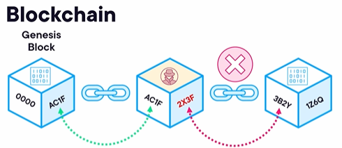

## Overview of Cryptographic Solutions
Understanding cryptographic solutions is crucial because encryption is ubiquitous—working either for or against us.

### 1. Topics to Cover
*   **Core Concepts:** 
    - PKI, encryption tools, obfuscation, hashing and salting, digital signatures, key stretching, blockchain (as an open public ledger), and digital certificates.
*   **The Importance of Currency:** 
    - Relying on legacy or deprecated encryption technologies believing they are "good enough" can be incredibly costly. If you are not up-to-date, your methods have likely already been bypassed.
*   **Shared Responsibility:** 
    - Security is everyone's responsibility, even if it is not your direct task.

<b>Public Key Infrastructure (PKI)</b>

---

## What is PKI?
PKI (Public Key Infrastructure) provides the foundation for secure digital communications.

### 1. Definition and Composition
*   **Core Function:** 
    - The components that enable the use of digital certificates and a two-key system (public and private keys) for encryption and other services.
*   **Infrastructure Components:** 
    - PKI is an amalgam of hardware, software, people, policies, and procedures working together.

---

## The Two-Key System
PKI relies on a mathematically linked key pair, where both keys can be used to encrypt or decrypt data depending on the specific use case.

### 1. The Public Key
*   **Visibility:** 
    - As the name implies, it is designed to be made publicly available to anyone.
*   **Primary Function:** 
    - Anyone can use your public key to encrypt information meant for you, ensuring that only you (the holder of the corresponding private key) can decrypt it.

### 2. The Private Key
*   **Visibility:** 
    - It is designed to be kept strictly private and secret.
*   **Security Predicate:** 
    - The entire security of the PKI system relies on the private key remaining uncompromised. If the private key is exposed, all bets are off.

<b>Key Escrow</b>

## What is Key Escrow?
Key escrow involves securely storing cryptographic keys with an independent entity to ensure data can be decrypted if the original keys are inaccessible.

### 1. Definition and Function
*   **Definition:** 
    - A trusted third party that holds the keys needed to decrypt data (conceptually similar to a mortgage company holding funds in escrow).
*   **Alternative Name:** 
    - It is often referred to in the industry as a "fair cryptosystem."

### 2. Primary Use Cases
*   **Data Recovery:** 
    - Serves as a backup recovery solution in cases where encryption keys are accidentally lost or destroyed.
*   **Legal Mandates:** 
    - Allows for the decryption of data if mandated by a court order or law enforcement requirement.

### 3. Security Concerns and Disagreements
*   **Management Feasibility:** 
    - There are industry disagreements regarding the technical feasibility of having a third party correctly and securely manage access to these keys.
*   **Collateral Compromise:** 
    - Since organizations can be hacked, there is a severe risk that the trusted third party could suffer a breach. If escrowed keys are leaked, the confidentiality and security of the entire system are compromised.

<b>Encryption Levels</b>

## The Purpose of Encryption
The primary goal of encryption is to keep data out of the hands of unauthorized actors, whether they are individual hackers, organized crime groups, or nation-states.

### 1. Encryption Strength
*   **Core Principle:** 
    - While no encryption is guaranteed to be secure forever,**the larger the key length and the stronger the algorithm**, the harder it becomes for an attacker to break it and access the data.

---

## Levels of Encryption
Data can be encrypted at various granularities depending on the specific security needs of the system.

### 1. Full Disk Encryption
*   **Function:** 
    - Encrypts the entire contents of a storage disk.
*   **Example:** 
    - BitLocker (commonly used on Windows laptops and desktops).

### 2. Partition Encryption
*   **Function:** 
    - A partial encryption applied only to one or more specific partitions, rather than the entire disk.

### 3. File or Volume Encryption
*   **Function:** 
    - Encrypts a specific single file, a group of files, or a specifically defined volume.

### 4. Database or Record Encryption
*   **Function:** 
    - Allows for the encryption of an entire database or targeting specific individual records within that database.

---

## Data States: At Rest vs. In Transit
Understanding the state of the data is critical for applying the correct encryption methodology.

### 1. Data at Rest
*   **Definition:** 
    - Data that is encrypted once it is physically written and stored on a disk.
*   **Protection:** 
    - Prevents data from being read if the physical device is stolen or if the storage drive is removed.

### 2. Data in Transit
*   **Definition:** 
    - Data that is encrypted prior to being sent over a network.
*   **Protection:** 
    - Prevents interception, eavesdropping, and packet sniffing while the data is actively moving between locations.
*   **Examples:** 
    - SSL, TLS, HTTPS, and IPSec.

<b>Symmetric Encryption</b>

## Understanding Symmetric Encryption
When discussing encryption algorithms, a primary distinction is made between symmetric and asymmetric encryption. 

### 1. Core Concept
*   **Definition:** 
    - Symmetric encryption uses the *same* key to both encrypt and decrypt a piece of data.
*   **Terminology:** 
    - Often referred to as "shared key" or "secret key" encryption.

### 2. The Encryption Process Flow
*   **Encryption (Sender):** 
    - Plaintext (e.g., "Hello Students!") + Secret Key + Encryption Algorithm = Ciphertext.
*   **Transmission:** 
    - The unreadable ciphertext is sent across the network.
*   **Decryption (Receiver):** 
    - Ciphertext + Same Secret Key + Decryption Algorithm = Plaintext (revealing the original message).

### 3. Key Characteristics and Considerations
*   **Speed:** 
    - Symmetric encryption is generally much faster than asymmetric encryption. (Note: Systems will often use a combination of both to properly secure communications).
*   **Key Management Risks:** 
    - This is the biggest concern with symmetric encryption. Both parties must securely share and know the exact same secret key.
    - It is difficult to definitively prove identity because multiple people could potentially know the key. If the key is compromised or passed around, anyone can decrypt the data.
*   **Algorithm Strength:** 
    - The overall strength of the encryption is directly affected by the length of the key.
    - A longer key requires more iterations through the algorithm, making it significantly harder and more time-consuming for an attacker to crack or brute-force.

<b>Asymmetric Encryption</b>

## Understanding Asymmetric Encryption
Unlike symmetric encryption, asymmetric encryption utilizes a two-key system (a public key and a private key) to secure communications.

### 1. Core Concept
*   **The Two-Key System:** 
    - Uses a mathematically linked key pair. 
    - One key is used for encryption, and the corresponding other key is used for decryption.

### 2. The Encryption Process Flow
To understand the flow, consider the classic example of Alice sending a secure message to Bob:
*   **Encryption (Sender):** 
    - Bob shares his *Public Key* with Alice. 
    - Alice uses Bob's Public Key and the encryption algorithm to turn her plaintext ("Hello Students!") into ciphertext.
*   **Transmission:** 
    - The ciphertext is sent across the network.
*   **Decryption (Receiver):** 
    - Bob uses his secret *Private Key* to decrypt the ciphertext back into plaintext. Because only Bob holds this private key, he is the only one who can read the message.

### 3. Key Characteristics and Security Rules
*   **Public Key Visibility:** 
    - As the name implies, this key is made publicly available to anyone who wants to send you a message.
*   **Private Key Security:** 
    - This key must be kept absolutely secret. If leaked, anyone could decrypt your messages or impersonate you by digitally signing documents (which completely breaks the concept of non-repudiation).
*   **The Dual-Direction Rule:** 
    - *Either* key can encrypt data, and *either* key can decrypt it, depending on the use case.
    - Encrypt with a Public Key $\rightarrow$ Decrypt with a Private Key (used for secure messaging).
    - Encrypt with a Private Key $\rightarrow$ Decrypt with a Public Key (used for digital signatures).
*   **The Cardinal Rule of Asymmetric Encryption:** 
    - A message encrypted with one key **cannot** be decrypted with that exact same key. (A public key cannot decrypt what a public key encrypted, and a private key cannot decrypt what a private key encrypted).

<b>Key Exchange</b>

## Key Exchange Methods
When establishing secure communications, cryptographic keys must be exchanged between parties. This is handled in two primary ways:

### 1. Out-of-Band Key Exchange
*   **Definition:** 
    - The key is not sent over the network.
*   **Delivery Mechanism:** 
    - The key must be delivered via traditional or manual means, such as in person, over the telephone, or via a courier.

### 2. In-Band Key Exchange
*   **Definition:**
    - The key exchange is performed directly over the network as the communication session is being established.
*   **Lifecycle:**
    - The keys can be created in real time and are typically discarded once the communication session is over.

<b>Cipher Suites</b>

## Understanding Cipher Suites
A cipher is simply an encryption algorithm used to secure data.

### 1. The Impact of Computational Power
*   **Technological Advancement:** 
    - Computational resources and processing speeds naturally increase year over year.
*   **Degradation of Strength:** 
    - Because computers are getting faster, strong ciphers can become weak (or weaker) over time. An encryption algorithm that is state-of-the-art today may be easily broken and deprecated in a few years.

### 2. Examples of Strong Ciphers
*   **AES (Advanced Encryption Standard):** 
    - Currently considered a highly secure and widely used strong cipher.
*   **Triple DES (3DES):**
    - A robust cipher that applies the DES algorithm three times to each data block.
*   **TwoFish:** Another highly regarded and strong encryption algorithm.

### 3. Weak and Deprecated Ciphers
*   **WEP and WPA:**
    - Historically used to secure wireless access points and mobile communications, these protocols were once state-of-the-art. 
*   **Vulnerability:**
    - As computing power increased, these were cracked very quickly and are now considered weak and completely deprecated.

<b>Tools (TPM, HSM, KMS, and Secure Enclave)</b>

## Cryptographic Key Management Tools
When shifting gears to discuss tools used for encryption, there are several specific hardware and software components you need to be aware of that are designed to securely store and manage cryptographic keys (like public and private keys).

### 1. Trusted Platform Module (TPM)
*   **Definition and Location:** 
    - A secure area in the form of a chip that is embedded directly onto the motherboard of a device (such as a laptop, desktop, computer, or server).
*   **Accessibility:** 
    - It is completely internal and not accessible from outside of the computer.
*   **Function:** 
    - Its primary purpose is to securely store cryptographic keys used for encryption directly on that specific local device.

### 2. Hardware Security Module (HSM)
*   **Definition and Flexibility:** 
    - Functionally similar to a TPM, as both are used for encryption and securely storing cryptographic keys. However, an HSM is not permanently built into the motherboard and can be added or installed later.
*   **Form Factor:** 
    - They are removable or external devices. 
    - They typically come as a plug-in card that can be inserted into a server or computer, or as a larger rack-mounted version.

### 3. Key Management System (KMS)
*   **Definition:** 
    - An in-house or third-party software platform.
*   **Function:** 
    - Used to manage encryption keys external to the devices that are actually being encrypted. It is highly effective for managing keys across a number of different devices.
*   **Pros and Cons (Risk):** 
    - While incredibly useful, the major downside is centralization risk. These systems are great as long as they do not get compromised, or as long as you "don't blow up that system and then all the keys are gone."

### 4. Secure Enclave
*   **Definition:** 
    - A dedicated, secure subsystem integrated directly into Apple "systems on a chip."
*   **Use Case:** 
    - Found in devices like iPhones, iPads, and so forth.
*   **Security Structure:** 
    - It is physically isolated from the main processor, which provides an extra layer of security for the data it protects.

<b>Steganography</b>

## Understanding Steganography
Steganography is a method of hiding data within other data, allowing information to be transmitted without drawing attention to its existence.

### 1. Core Concept
*   **The Trojan Horse Similarity:** 
    - It is similar in concept to a Trojan horse, where data is intentionally hidden inside of other data.
*   **Common Targets:** 
    - Messages or entire files can be secretly hidden inside of pictures or other types of media data.

### 2. Detection Challenges and Indicators
*   **Difficulty of Detection:** 
    - It is very difficult to detect because the hidden file is effectively "sprinkled" inside another file.
*   **Exploiting Whitespace:** 
    - Steganography often utilizes file types that have a lot of whitespace or allow for "junk" information (like pictures and images). This allows documents or data to be embedded without noticeably affecting the actual quality of the picture.
*   **Key Indicator:** 
    - A bloated or unusually large file size can be a strong indicator that something is not right and data might be hidden inside.

### 3. Steganography Tools
*   **Software Availability:** 
    - There are a number of different programs out there designed specifically to embed pictures, data, or other information inside of other files (references to these tools are typically included in supplemental slide decks).

<b>Tokenization</b>

## Understanding Tokenization
Tokenization is the process of replacing sensitive data with a non-sensitive equivalent, known as a token, to secure transactions and protect information.

### 1. Token Characteristics
*   **Flexibility:** 
    - Tokens can be single-use or multiple-use.
    - They can be cryptographic or non-cryptographic.
    - They can be reversible or irreversible.

### 2. Main Types of Tokens
*   **High-Value Tokens (HVTs):** 
    - Used to replace highly sensitive information, such as Primary Account Numbers (PANs) on credit card transactions. 
    - These can be bound to specific devices.
*   **Low-Value Tokens:** 
    - Serve a similar function to HVTs, but they require the underlying tokenization system to successfully match the token back to the actual primary account number (PAN).

---

## Tokenization in Action (Transaction Example)
While it happens very quickly (like when you tap or insert your card at a point-of-sale terminal), the backend process of a tokenized transaction is quite complex. Here is the step-by-step flow:

### 1. The Transaction Flow
*   **Step 1: The Purchase:** 
    - The customer makes a purchase, generating a token.
*   **Step 2: The Merchant:** 
    - The token is sent to the merchant.
*   **Step 3: The Merchant Acquirer:** 
    - The merchant passes that token along to the merchant acquirer.
*   **Step 4: The Network:** 
    - The merchant acquirer passes the token to the payment network.
*   **Step 5: The Token Vault:** 
    - The network consults the token vault to match the token with the customer's actual account number (PAN).
*   **Step 6: The Bank:** 
    - The network passes both the token and the PAN to the actual bank. 
*   **Step 7: Authorization and Return:** 
    - The bank verifies the funds, authorizes the transaction, and sends the approval information back through the network, the acquirer, and the merchant to complete the transaction.

<b>Data Masking</b>

## Understanding Data Masking
Data masking is the process of obfuscating specific data elements to protect sensitive information from unauthorized exposure. 

### 1. Application and Database Masking
*   **Scope:** 
    - Can be applied at the individual record, row, column, or an entire table within an application or database.

### 2. IP Address Masking
*   **Mechanism:** 
    - Utilizes Network Address Translation (NAT).
*   **Function:** 
    - Enables private IP addresses to be hidden or masked behind a proxy or a firewall.

### 3. Masking Types and Methods
*   **Implementation States:** 
    - Can be **static** (masking data at rest) or **dynamic** (masking data in transit).
*   **Common Methods:** 
    - Achieved through a variety of techniques, including encryption, substitution, nulling, or tokenization.

---

## Data Masking in Action (Query Example)
To understand how data masking works in practice, consider a database query for two users, Alice and Bob:

### 1. Unmasked Query Result
*   **Result:** 
    - When a person or system queries the database, it returns the full, unprotected information (e.g., their complete Social Security Numbers).

### 2. Masked Query Result
*   **Result:** 
    - The database obfuscates the sensitive data before returning it. 
    - It might confirm Alice and Bob are in the system, but their Social Security Numbers are "Xed out" or only show the last four digits.
*   **Benefit:** 
    - Ensures that sensitive data is not fully exposed to the person or system requesting the data, regardless of what they query.

<b>Hashing</b>

## Understanding Hashing
Hashing is a cryptographic method used to verify the integrity and veracity of data, ensuring it has not been altered or tampered with.

### 1. Core Concept
*   **Mechanism:** 
    - Applies a mathematical algorithm to a file, volume, partition, or entire disk.
*   **Key Behavior:** 
    - If even one tiny piece of information within the file changes, the resulting hash value will be completely different.

### 2. Common Hashing Algorithms
*   **Examples:** 
    - MD5, SHA-1, and SHA-2 are among the most commonly used hashing algorithms.

---

## Hashing in Action (Example)
To understand how sensitive a hash is to change, consider the following example using the SHA-1 algorithm:

### 1. The Original Hash
*   **Input:** 
    - "Pluralsight is really the best training on the planet!"
*   **Result:** 
    - Generates a very specific, unique alphanumeric hash string.

### 2. The Modified Hash
*   **Input:** 
    - "Pluralsight is really the best training on the planet" *(exclamation point removed).*
*   **Result:** 
    - Because a single character was changed, the resulting hash is completely different from the original.

---

## Primary Use Cases
Hashing is critical in scenarios where proving data integrity is paramount.

### 1. Secure Data Transmission
*   **Process:** 
    - The sender hashes the information before sending it. 
    - The recipient runs the exact same hash algorithm upon receiving it. 
*   **Validation:** 
    - If the two hash values match perfectly, they know the data was not tampered with in transit.

### 2. Digital Forensics
*   **Process:** 
    - An investigator runs a hash on a collected hard drive before performing any evidence collection or processing.
*   **Validation:** 
    - Before presenting the drive in court, the investigator runs the hash again. If the values match, it conclusively proves there was no tampering with the drive's data throughout the entire investigation process.

<b>Salting</b>

## Understanding Salting
Salting is a cryptographic technique applied to passwords or passphrases to significantly enhance their security against common cracking methods.

### 1. Core Concept
*   **Definition:** 
    - Random (or pseudo-random) data that is used as an additional input into a one-way function or a hash.
*   **Function:** 
    - It combines the original string (the user's password) with this unique salt value before the hashing algorithm is applied.

### 2. Security Benefits
*   **Attack Prevention:** 
    - Specifically designed to defend against dictionary attacks and rainbow table attacks.
*   **Brute-Force Resistance:** 
    - By adding this additional random information, it makes attempting to brute-force or crack the specific password using conventional methods incredibly more difficult.

---

## Salting in Action (Example)
To understand how salting is applied, consider a database storing credentials for two individuals (User 1 and User 2):

### 1. The Salting Process
*   **The Salt Value:** 
    - A unique, randomly generated string is created for the user.
*   **The String to be Hashed:** 
    - The user's actual chosen password.
*   **The Final Hashed Value:** 
    - The resulting hash that is actually stored in the database, which is a mathematical combination of both the user's password *and* their unique salt value.

<b>Digital Signatures</b>

## Understanding Digital Signatures
Digital signatures utilize an asymmetric encryption algorithm (a two-key system using a public key and a private key) to guarantee the authenticity and integrity of a message.

### 1. Core Security Benefits
*   **Integrity:** 
    - Ensures the message or file has not been altered or tampered with while in transit.
*   **Non-Repudiation:** 
    - Proves definitively who sent the message. Assuming the sender's private key has not been compromised, they cannot deny having sent the message.

---

## Digital Signatures in Action (Email Example)
To understand how this process works, consider the scenario of Alice sending a digitally signed email to Bob. (Most modern email programs have this capability built-in).

### 1. The Signing Process (The Sender)
*   **Hashing:** 
    - Alice's email program applies a hashing algorithm (like MD5, SHA-1, or SHA-2) to the email to generate a specific hashing value.
*   **Signing:** 
    - Alice uses her **private key** to encrypt (sign) that specific hashing value.
*   **Transmission:** 
    - The email message, along with the encrypted signature, is sent to Bob.

### 2. The Verification Process (The Recipient)
*   **The Key Exchange:** 
    - Bob and Alice share public keys, so Bob already has a copy of Alice's **public key** on his key ring.
*   **Decryption:** 
    - When Bob receives the email, his program uses Alice's public key to unencrypt the signature and extract the original hashing value.
*   **Validation:** 
    - The program runs the exact same hashing algorithm on the received email and compares the two hash values. 
    - If the "before and after" hash values match perfectly, it proves the email was not tampered with in transit (Integrity).
    - Because the signature could only be decrypted by Alice's public key, it proves that it had to be signed by Alice's private key (Non-repudiation).

<b>Key Stretching</b>

## Understanding Key Stretching
Key stretching is a technique used to take an initial key or password that may not be inherently strong and "stretch" it to make it significantly more secure. 

### 1. The Stretching Mechanism
*   **Adding Randomness:** 
    - The process adds pseudorandom data (such as a hash, a cipher, or an HMAC) to the password or passphrase.
*   **Salting:** 
    - It utilizes *salting* to inject additional randomness into the string.
*   **Iteration:** 
    - This mathematical process is repeated over and over many times. 
*   **The Derived Key:** 
    - The repeated process creates a "derived key" that can be used as a cryptographic key for subsequent sessions. Each time it is processed, it generates a different key.

### 2. Security Benefits
*   **Attack Prevention:** 
    - By making the key longer and adding complex randomness, it becomes much more difficult for attackers to crack or brute-force.
*   **Rainbow Tables:** 
    - Specifically guards against rainbow table attacks.

---

## Key Derivation Functions
There are several specific functions and algorithms used in the industry to perform key stretching. 

### 1. PBKDF2
*   **Definition:** 
    - Stands for **P**assword-**B**ased **K**ey **D**erivation **F**unction **2**.
*   **Standard:** 
    - It is part of the RSA, PKCS #5 version 2.0 standard.
*   **Function:** 
    - Applies a pseudorandom function to a password or passphrase to stretch and strengthen the key.

### 2. Bcrypt
*   **Origin:** 
    - Created in 1999, it is a key derivation function based on the Blowfish algorithm.
*   **Function:** 
    - Specifically designed to be used for passwords. 
*   **Mechanism:** 
    - It incorporates a dedicated salt function to add additional randomness, deliberately designed to guard against rainbow table attacks (much like adding salt to food enhances it, adding salt here makes the key inherently stronger).

<b>Blockchain</b>

## Understanding Blockchain
Blockchain is an immutable, decentralized digital open public ledger distributed across a massive network of computers.

### 1. Core Characteristics
*   **Immutability:** 
    - Once a transaction is recorded in the ledger, it cannot be altered or removed.
*   **Benefits:** 
    - Provides trust, transparency, near real-time processing of transactions, and an incredibly tamper-resistant system.

### 2. History and Cryptocurrency Distinction
*   **Origins:** 
    - Initially conceived in 1991 as a way to timestamp digital transactions.
*   **Mass Adoption:** 
    - Gained widespread recognition in 2009 when Satoshi Nakamoto utilized it for Bitcoin.
*   **The Distinction:** 
    - Blockchain and cryptocurrency are *not* the same thing. Cryptocurrency uses the underlying technology of blockchain, but blockchain can exist entirely independent of cryptocurrency.

---

## Blockchain Architecture
The ledger is built using sequential "blocks" of data linked together using cryptographic hashing.

### 1. Block Composition
Each block in the chain contains three primary components (along with timestamps and other metadata):
*   **Data:** 
    - The batch of transactions or information being stored.
*   **A Hash:** 
    - The unique cryptographic hash value generated from the data in that specific block.
*   **The Previous Hash:** 
    - The cryptographic hash value of the block immediately preceding it in the chain.

### 2. The Chain Mechanism
*   **The Genesis Block:** 
    - The very first block in the chain. Because there is no block before it, it does not contain a "previous hash" record.
*   **Linking:** 
    - Every subsequent block adds new data, generates a new hash, and securely records the hash of the block right before it. This process mathematically links every block together.

---

## Security and Tamper Resistance
The combination of continuous hashing and decentralized consensus makes the blockchain virtually impossible to fraudulently alter.

### 1. The Hashing Defense
*   **The Break Scenario:** 
    - If a bad actor attempts to alter the data in a historical block, the resulting hash of that block will instantly change.
*   **Invalidation:** 
    - Because that newly altered hash no longer matches the "previous hash" record stored in the next block, the mathematical chain breaks. Everything from that point forward is immediately invalidated.

### 2. Network Consensus
*   **The 50% Rule:** 
    - Because the ledger is distributed across many computers, a hacker cannot just change their own copy. To spoof the system, they would have to successfully alter the block (and recompute all subsequent blocks) on **over 50%** of all the computers on the network.
*   **Rejection:** 
    - If the corrupted chain does not reach this 50% network consensus, the alterations are simply rejected by the blockchain network, preserving the absolute integrity of the ledger.

<b>Certificate Authority and CSR</b>

## Certificate Authorities (CA)
A Certificate Authority is an entity that issues digital certificates, acting as a trusted third party to verify identities and secure communications.

### 1. Types and Examples
*   **Scope:** 
    - CAs can be internal (managed within a specific corporation) or external (a public, trusted third party).
*   **Common External CAs:** 
    - Examples include Symantec, GeoTrust, Comodo, Entrust, GlobalSign, DigiCert, and Thawte.
*   **Browser Trust:** 
    - Certificates from these major external CAs are typically installed by default on our web browsers to establish automatic trust.

### 2. Establishing a Secure Connection (Banking Example)
When a user (Bob) connects to a financial institution, a specific key-exchange process occurs to establish a secure session:
*   **The Public Key:** 
    - The bank presents its public key to the user's browser.
*   **Session Keys:** 
    - The browser uses the bank's public key to encrypt session keys and sends them back to the bank.
*   **Bulk Encryption:** 
    - Only the bank (using its closely guarded private key) can decrypt those session keys. Once extracted, the keys are used to develop bulk encryption keys for ongoing communication.
*   **Result:** 
    - The communication takes place securely over TLS or SSL (establishing an HTTPS connection).

### 3. Certificate Validation
Just like a police officer checks with dispatch to ensure a driver's license is still valid, browsers must verify that a presented certificate is still trusted by the CA.
*   **CRL (Certificate Revocation List):** 
    - A list checked to see if the specific certificate has been explicitly revoked by the CA.
*   **OCSP (Online Certificate Status Protocol):** 
    - An alternative protocol used to query the validity status of a certificate in real-time.

---

## Certificate Signing Request (CSR)
When a person or organization wants to apply for a digital certificate from a CA, they must submit a formal request with specific information.

### 1. CSR Standards
*   **PKCS #10:** 
    - The most common Public Key Cryptography Standard format used for generating a CSR.

### 2. Required Validation Fields
Before a CA will issue a digital certificate, the applicant must provide the "bare bones" details of the request, which the CA will then validate. These required fields include:
*   **Common Name**
*   **Business Name**
*   **Department**
*   **City**
*   **State**
*   **Country**
*   **Email Address**

