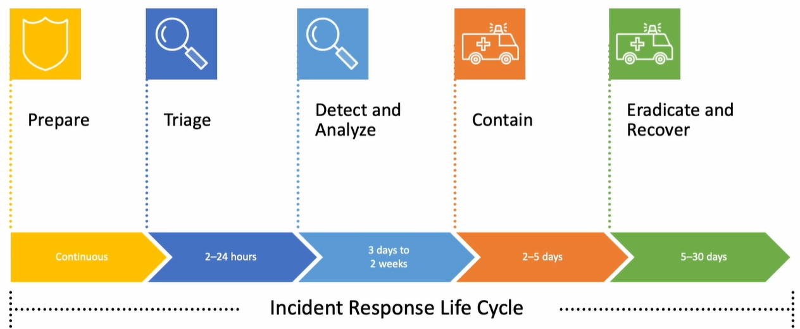

Why Are We Here?

## Goal of Host Analysis

- Get to the **very root of this compromise**.
- Analyze **host data to identify malicious activity related to an incident**.
- Avoid getting distracted by **potential red herrings**.

## Incident Background

- You are the **third-party incident responder** requested by Globomantics.
- Confirmed incident:
  - A **ransomware attack on their research facility**.
- Actions already performed:
  1. Confirmed the event on one of the originally discovered devices.
  2. Performed **initial triage**.
  3. Gathered some rough **IOCs**.
  4. Accomplished **initial scoping of the ransomware attack**.
- Globomantics uses the initial information to:
  - Craft a plan for **business mitigation**.

## Current Phase: Analysis

- Find the **root cause**.
- Answer questions to enable decisions that affect the impact of the event.
- The orbit of the **dark energy satellites** is slowly degrading.

**Main questions**

- **Why did this happen?**
- **What was the root cause?**
- **How did the threat actor get in?**

## Why the Initial Access Vector Matters

- The next phase is **containment and eradication**.
- Removing infected devices and wiping their hard drives:
  - Does not close the **same initial access vector**.
- You never patched it:
  - They're just going to come right back in.
- **That's not containment, that's treating the symptoms.**

## Next Decision Point

- Find out **how the threat actor got in**.
- The organization can proceed with:
  - **Closing that initial access vector**.
  - **Containment**.
- A good place to start:
  - Looking for **patient zero**.

Demo: Network Connections and Patient Zero

## Look for Connections

- For computers, it spreads over the **network**.
- Use the triage pulled from the two victim boxes:
  - **DNS cache**.
  - **ARP cache**.
  - **Network connections**.
- The lab uses **two different host triage files**:
  - Keep it simple.
  - The same analysis can expand over more devices.

## DNS Cache

**Victim 1**

- The **hello.iamironcat.com** domain was resolved.
- That's the domain associated with the **ransomware malware**.

**Victim 2**

- Different information:
  - Other IPs.
  - **Pointer records**.
- Instead of looking up the IP associated with the name:
  - Looking at the **name associated with the IP**.
- Interesting finding:
  - Looking up something **within its same network**.
  - It doesn't exist on the other device.

## Compare Files in VS Code

1. Select one file for comparison.
2. Compare the other file with the selected one.
3. VS Code will **highlight the differences**.

**Record the finding**

- **172.31.37.10**
- Found in the **DNS cache**, but only on **victim 2**.
- Could this just be something random on the network?
  - Absolutely.
- **Take notes of everything that you find.**

## ARP Cache and XML Files

- Text files can be **messy to look at**.
- XML files can be imported into **PowerShell objects**.
- Use a **PowerShell terminal**.
- **Import-Clixml**:
  - Import that information.
- Things that start with a **dollar sign**:
  - Containers, also called **variables**.
  - Store this information.

**Why use PowerShell objects?**

- Look at just the **IP addresses** inside the file.
- Import information from **victim 1 and victim 2**.
- Look at them together in the same console.
- PowerShell is native on Windows:
  - Used for initial triage.
  - No need to load other programs.

## What the ARP Cache Helps Reveal

- **Layer 2**.
- Matching the **MAC address** with the **IP address**.
- Cached on individual devices.
- See devices that have:
  - Connected.
  - Been broadcasting within the **same subnet**.

**Finding patient zero**

- Look at all the other boxes around the affected device.
- Understand **what they're connecting to**.
- Follow those connections back:
  - Find **where it came from**.

## Combine the ARP Lists

1. Import the ARP information from both devices.
2. Combine those lists into a new variable called **MegaArp**.
3. **Sort for unique objects**.
4. Identify the **unique IP addresses between both devices**.

**Finding**

- Again, **172.31.37.10**.
- Record that it appeared in:
  - **DNS cache**.
  - **ARP cache**.
- A lot of the other entries are **broadcast**.

## Import and Combine Network Connections

1. Use the network connection **XML files**.
2. Import victim 1 into a new variable called **v1**.
3. Import victim 2 into **v2**.
4. Combine these into one variable.

**What you can examine**

- Unique IPs.
- Current connections.
- Established or listening connections.
- Unique ports.
- Remote ports and local ports.

**Across more devices**

- The same process can be applied across **30 devices**.
- Sort and compare the information across the collected data.

## Sort and Group the Ports

**Sort and unique**

- Reduces a large, messy list.
- Makes unusual ports easier to identify.
- **The unique case or the case that's least common is always really interesting.**

**Group-Object**

- Groups them by **frequency**.
- Lab observations:
  - **Port 80**: 23 times.
  - **Port 0**: 51 times.
  - High ephemeral ports: one connection each.
  - **Port 15111**: two connections.

## Understand the Environment

- These are **user boxes**, not servers, inside a **user VLAN**.
- There shouldn't be a ton of connections that we don't understand:
  - **Especially between them**.

| Port or connection | Discussion in the lab |
|---|---|
| **80** | Expected remote connections to things like websites. |
| **High ephemeral ports** | Randomly generated within that range from the device initiating the connection, generally speaking. |
| **15111** | Stands out and needs to be tracked down. |
| **135 and 139** | Ports you are going to see in a Windows environment. |
| **445** | SMB; files, GPOs, and Active Directory. |
| **3389** | Remote desktop connection; expected because that is how the lab devices are accessed. |
| **WinRM** | Also present in the collected connections. |
| **8080** | The IOC from the web shell that dropped from the ransomware. |

- **8080** is not a new IOC.
- **15111** is the new connection of interest.
- An RDP connection could be interesting in another environment:
  - In this lab, it is expected.

## Drill Down on Port 15111

1. Look for the property **RemotePort**.
2. Find where it **equals 15111**.
3. Get **all the information back**, instead of grouping only some information.
4. Check the **remote address**.

**Finding**

- Connecting to **172.31.37.10**.
- Add to the notes:
  - A **strange port, 15111**, on that same IP.

## Combine the Evidence

**172.31.37.10 appears in:**

1. **DNS cache**.
2. **ARP cache**.
3. **Network connections on port 15111**.

- These three pieces become **really interesting**.
- Collect and analyze data **en masse**.
- Automate across **large sets of data**, even without additional tooling.
- Visual tools and algorithms can also help identify these connections.

More to Consider

## No Obvious External C2

- IOCs of the domain and IP talking internally and externally.
- Nothing that stands out as **external C2**.
- Generally speaking, attacker methodology for command and control:
  - An **internal-to-external connection** called a **reverse shell**.

## Reverse Shell and Internal Chaining

- An attacker with a reverse shell from **one device**.
- Then **chaining that connection internally**.
- Avoids excess internal-to-external traffic.

| Traffic | Meaning |
|---|---|
| **North/south** | Internal-to-external traffic. |
| **East/west** | Internal device-to-device traffic. |

## Why Internal Chaining Is Harder to Catch

- Most organizations do not have **peer device-to-device connections monitored**.
- Network monitoring is often at the **boundary**:
  - Catch north/south traffic.
  - Not catch east/west traffic.
- **The fewer times the adversary traverses the boundary, the less likely they are to be caught.**

## Malware Domain and C2 Domain

- The domain used for the malware may **not be the same** as the domain used for the **C2 channel**.
- Crafty attackers work to ensure that their traffic:
  - **Follows a normal pattern**.

## Web Shell and Outside-to-Inside Commands

- A **web shell** was found:
  - Common behavior for this threat actor.
- May be looking for:
  - **Outside-to-inside commands through a web server**.
- This would model a **standard traffic pattern**.
- The attacker could then pivot to internal devices:
  - From a **user device**.
  - To a **share server**.
  - Back down to a **user device**.

## Use Host Firewall Logs

- Leverage host firewall logs from the **System32 log files folder**.
- Collect across **multiple affected devices**.
- Reveal internal connections and chaining behavior.
- Useful even in a ransomware situation:
  - Very unlikely that this data has been encrypted.
- Network-traffic-based methods provide another perspective:
  - Covered in the **network analysis course**.

Demo: Firewall Logs

## Evidence Storage

- The triage directory is a **separate mount**.
- Keep all of the malicious stuff inside this mount.
- The volume can be:
  - Zipped up.
  - Moved to different devices.
  - Wrapped up using a tool like **DD**.
- Evidence should be **transferable**:
  - So other people can use it as well.

## Windows Event Logs vs. Firewall Logs

| Log type | What happened in the lab |
|---|---|
| **Windows event logs — EVTX** | Cleared with the ransomware. |
| **Firewall logs — .log files** | Still available for analysis. |

**Firewall logs**

- Inside the **firewall folder**, under the collected **System32 log files**.
- Simple **.log files**:
  - Really text files.
  - Not part of the Windows event logging system.
- In this lab:
  - Not cleared with the event logs.
  - Not encrypted.

## Information in Firewall Logs

- Local IP.
- Remote IP.
- Both ports.
- Timestamp.
- Whether the connection is **allowed or denied**.

**Why combine them?**

- An excellent set of information for connections made from each device.
- Combined across devices:
  - A **powerful set of information**.

## Revenet and Elastic Stack

**Revenet**

- Takes the firewall logs.
- Enriches them with different data:
  - Such as **threat intelligence data**.
- Puts the data into an **Elastic Stack**.

**Elastic Stack**

- Analyze information across multiple devices.
- Use the **graph capability**.
- The lab data source:
  - Firewall logs from **victim 1 and victim 2**.
  - Brought in with **Logstash**.
  - Collected into an **index**.

**Another graph option mentioned**

- **Apache Spark**.

## What Graph Algorithms Show

- Look at transitions or things that are:
  - **1, 2, or 3 degrees apart**.
- Show connections between:
  - Adjacent logs.
  - Columns.
  - Sets of information.
- Firewall connection data is well suited for graph algorithms.
- Similar to **parent process-to-process information**:
  - Shows how connections are made.

## Create the Connection Graph

1. Select the **data source**.
2. Add **source IP — SRC IP**.
3. Add **destination IP — DST IP**.
4. Focus on the **internal IPs**.
5. Add the **destination port**:
   - Understand what ports those connections used.

**External IPs**

- The tool can also add external IPs.
- Useful for seeing external connections.
- Here, the focus is on **internal connections**.

## Devices in the Investigation

| Device | IP address |
|---|---|
| **Victim 1** | **172.31.37.30** |
| **Victim 2** | **172.31.37.20** |
| **Device of interest** | **172.31.37.10** |

- Victim 1 and victim 2 were infected with **ransomware**.
- Both show internal connections involving **172.31.37.10**.
- That peer device did **not show up in initial triage as affected by the ransomware**.

## Investigate Port 445

- The graph shows connections over **445**.
- **445 is SMB**.
- **SMB pipes** can be a common way for attackers to create internal connections:
  - From one device to another.
- Attackers use ports that are supposed to be open inside a domain.
- But those ports aren't necessarily supposed to be communicating:
  - **Between two endpoint devices**.

## Filter and Expand the Graph

- Filter by **destination port 445**.
- Search for traffic associated with **172.31.37.10**.
- Graph again to focus on connections to that device.
- Expand connections:
  - Find other associated ports.
- Add the **destination port**:
  - Understand what those connections are doing.

## Interpret the Graph Carefully

- The width of the line represents the **strength of the connection** in the graph.
- Strong connections stand out:
  - Multiple devices connecting to **one point**.
- The graph shows lines connecting:
  - **.30 to .10**.
  - **.20 to .10**.
- Helps investigate possible **lateral C2**.
- **This isn't a slam dunk**:
  - Still need to understand what those connections mean.

## Current Connections vs. Historical Connections

| Evidence | What it reveals |
|---|---|
| **Netstat / collected network connections** | Existing connections at collection time. |
| **Firewall logs** | Connections that happened in the past. |

**Lab findings**

- Current connections:
  - **Port 15111**.
- Historical firewall logs:
  - Additional traffic over **445**.
- Those **445 connections** did not appear in the current network connection snapshot.
- Historical timestamps help establish the sequence.

## Potential Attacker Behavior

1. Connections over **445**.
2. **Transfer files**.
3. **Execute commands**, such as **PsExec**.
4. Connections back from those devices:
   - Establish a **reverse shell internally** to that machine.

**Why this matters**

- Seeing related evidence in **four different places**:
  - DNS cache.
  - ARP cache.
  - Network connections.
  - Firewall logs.
- Means we likely need to go to **172.31.37.10 next**.

Patient Zero?

## What Was Accomplished?

- Got really close to confirming which device was **patient zero**.
- Revealed a potential:
  - **Live actor**.
  - **C2 structure**.
- Confirmation would involve:
  - **Network traffic analysis**.
  - Answering some of the same questions **in parallel**.

## Use the Evidence Available

- These collection and analysis methods are **not an all-inclusive list**.
- In an actual response event:
  - You may not have all this **data**.
  - You may not have all this **access**.
- The same questions can be answered from:
  - A **different perspective**.
  - **Different data sources**.
  - **Other methods**.

**What matters**

- **Being resourceful**.
- **Adapting to the situation**.
- **Using what you do have to answer the questions that need to be answered**.

## Next Step

- Investigate the device that looks like a **nexus of internal host network connections**.
- Look at its collected:
  - **Processes**.
  - **Services**.
- Compare them to the internal **IOCs — indicators of compromise** found in triage.
- Figure out whether that **behavior is the same**.

