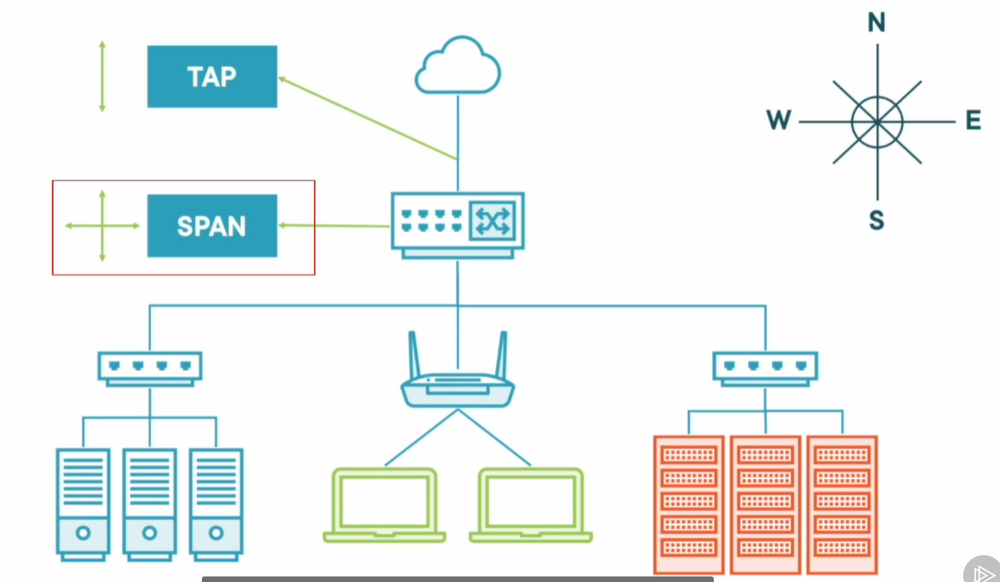

How Do We See This Traffic?

## Questions to Ask

- **Should hosts be talking to other hosts?**
  - Individual user clients: **not usually**.
- **What protocols and ports make sense for our network?**
- You've already seen unusual communication using **port 15111**.
- Broaden the search:
  - Classify the **internal network communication**.

## North-South Traffic

- Initial network capture often starts with:
  - Installing a **TAP at the network boundary**.
- Captures **north-south traffic**:
  - Conversations **exiting or entering your network**.
- What can be missed:
  - Hosts and servers communicating **inside the network**.

## East-West Traffic

- Internal communication is **east-west traffic**.
- Often captured using a:
  - **Mirrored port**.
  - **SPAN port**.
- A capable network device duplicates the traffic:
  - Through its configuration.

## Why the Capture Location Matters

- Adversaries prefer to limit **external-to-internal communication**.
- Understand **where the data is coming from**:
  - Ensure you have the necessary information.
- Focus on the **.10 machine**:
  - Validate whether this is **ground zero**.

Demo: Lateral Movement

## 1. Start with Kibana

- Zeek data has been forwarded into **Elasticsearch**.
- A Kibana dashboard provides:
  - A **high-level overview** of conversations.
- The underlying data is still:
  - **Zeek's conn.log**.

## Search for Port 15111

- Filter:
  - **destination.port equal to 15111**.
- Identify other internal hosts communicating over that port.

**Findings**

| Host | Destination |
|---|---|
| **172.31.64.10** | **172.31.37.10** |
| **172.31.37.20** | **172.31.37.10** |
| **172.31.37.30** | **172.31.37.10** |

- **172.31.64.10** is on a different subnet.
- The lab is deliberately limited to a few hosts:
  - Makes the individual artifacts easier to see.
- A production environment could have:
  - A much larger list.

## 2. Reverse the Direction

- Investigate what **.10 is communicating to**.
- Set the source IP:
  - **172.31.37.10**.
- Set the destination range:
  - **172.31.37.0/24**.
- This focuses the search on:
  - Communication to that internal subnet.

**Finding**

- More than **137,000 conversations**.
- A lot for an **individual client IP**.

## Examine the Connection State

- Most entries are **S0**:
  - Initial SYN seen.
  - No reply.
  - Probably unsuccessful connection attempts.
- In the pie chart:
  1. Click **S0**.
  2. Open the filter.
  3. Select **Exclude results**.

- This removes the S0 entries:
  - Makes the remaining communication easier to inspect.
- **.20 and .30** appear in the results.

## Destination Ports of Interest

| Port | Observation |
|---|---|
| **8080** | The previously identified **web shell** traffic. |
| **139** | SMB-related communication. |
| **445** | SMB communication. |
| Other traffic | Network discovery that appears normal in this environment. |

- SMB between individual client endpoints:
  - Stands out in this environment.
- Investigate whether **files were transferred**.

## 3. Extract the .10 Traffic with TCPDump

- Read:
  - **incident.pcap**.
- Use:
  - **-nn** to avoid hostname and port-name resolution.
- BPF filter:
  - **host 172.31.37.10**.
- Write the output:
  - **ground-zero.pcap**.

## Run Zeek in a Separate Directory

1. Create a separate directory.
2. Keep the new logs and extracted files together.
3. Run Zeek against **ground-zero.pcap**.
4. Review the generated protocol logs.

- Purpose:
  - Keep the analysis **isolated and organized**.

## 4. Validate the Kibana Findings

- Extract fields from **conn.log** using **zeek-cut**.

| Field | Information |
|---|---|
| **id.orig_h** | Originating host. |
| **id.resp_h** | Responding host. |
| **id.resp_p** | Responding port. |
| **service** | Detected application protocol. |
| **conn_state** | Connection state. |

- Use a reverse grep filter:
  - Exclude **S0**.
- Use **awk**:
  - Isolate traffic from **.10 to .20**.
  - Then inspect traffic from **.10 to .30**.
- Use **sort** and **uniq**:
  - Compare the types of conversations.

## Findings for .20 and .30

**.10 → .20**

- **73 conversations over port 8080**.
- Communication over:
  - **445**.
  - **139**.

**.10 → .30**

- Similar traffic.
- More conversations over **139**.

**Next focus**

- **SMB traffic to both endpoints**.

## 5. Examine smb_files.log

- Zeek records information about files seen over **SMB**.
- Open:
  - **smb_files.log**.

**Findings**

| Detail | Observation |
|---|---|
| **Source** | **172.31.37.10** |
| **Destinations** | **172.31.37.30 and 172.31.37.20** |
| **Port shown** | **445** |
| **Action** | **SMB::FILE_OPEN** |
| **Filename** | **daisypayload.bat** |

- Client endpoints exchanging a batch file:
  - Requires further investigation.
- Extract the file:
  - Find out what it does.

## 6. Enable Zeek File Extraction

1. Locate the preloaded **Zeek scripts** directory.
2. Copy the **file-extract script** into the analysis directory.
3. Inspect the script.
4. Rerun Zeek with that script.

## What the File-Extraction Script Does

| Component | Purpose |
|---|---|
| **PacketFilter** | Uses a BPF filter to focus on **port 445**. |
| **File New event** | Responds when Zeek identifies a file being transferred. |
| **Extract analyzer** | Extracts the file content. |
| **MD5 analyzer** | Calculates an **MD5 hash** of the file. |

- A new directory is created:
  - **extract_files**.

## 7. Examine files.log

- Contains information about files Zeek detected.
- **Two files** were detected:
  - One from **.10 to .30**.
  - One from **.10 to .20**.
- Both have the filename:
  - **daisypayload.bat**.
- Both have the **same MD5 hash**.

**Meaning in this investigation**

- The evidence indicates the **same batch file was delivered to both endpoints**.
- Avoid repeating the same analysis:
  - Analyze one copy.

## Understand the Extracted Filenames

- Zeek's extracted filenames include:
  - **extract**.
  - A **timestamp**.
  - The detected protocol:
    - **SMB** in this case.
  - A **unique file ID**.

**Why this helps**

- Use timestamps when comparing with connection records.
- Use the unique file ID:
  - Correlate the extracted file with **files.log**.
- Especially useful when many files have been extracted.

## 8. Identify and Read the File

- Use the Linux **file** tool:
  - Identify the file type.
- Result:
  - **ASCII text**.
- Use **cat**:
  - Inspect the batch file's contents.

## Suspicious PowerShell Command

- The batch file contains PowerShell with:

| Component | Purpose |
|---|---|
| **exec bypass** | Requests an execution-policy bypass for the session. |
| **non-interactive** | Runs without interactive prompts. |
| **windowstyle hidden** | Hides the PowerShell window. |
| **-e** | Supplies an encoded command. |

- A large block of **encoded information** follows.
- Investigate it with **CyberChef**.

## 9. Copy the Content with xclip

- Use the Linux tool **xclip**:
  - Copy the large block of text to the clipboard.
- Paste into **CyberChef**.
- Remove the first line containing the command switches:
  - Keep the encoded information.

## 10. Decode the Outer Layer

- The string contains:
  - Alphanumeric characters.
  - An equal sign at the end.
- It looks like **Base64**.
- Apply **From Base64**.

**Result**

- The decoding works.
- Dots appear between characters.
- The demonstration removes **null bytes**:
  - Makes the text easier to read.

## Inspect the Decoded PowerShell

- **IEX** means:
  - **Invoke-Expression**.
- The command creates a new object:
  - Decompresses additional string information.
- That inner string also appears:
  - **Base64-encoded**.

## 11. Examine the Inner Layer

1. Copy the encoded data inside the relevant parentheses.
2. Paste it into CyberChef's input.
3. Apply the decoding recipe.
4. Inspect the remaining output.

**Finding**

- The output is still unreadable.
- CyberChef's **magic** icon identifies:
  - **GZip-compressed data**.

## Stop at the Required Level of Analysis

- Further analysis moves into:
  - **Malware analysis**.
  - **Reverse engineering**.
- Enough evidence has been collected to identify:
  - Malicious use of the batch file.
  - Delivery from **.10** to the ransomware-infected hosts.
- Pass the artifacts to the:
  - **Malware analysis team**.
- Continue the incident investigation.

How Advanced Is Our Adversary?

## What Was Established?

- Internal communication starts with:
  - **172.31.37.10**.
- It reaches other internal hosts using:
  - **SMB**.
- A batch-file payload was:
  - Found in the traffic.
  - Extracted.
  - Analyzed as part of identifying the **reverse-shell activity**.
- The associated reverse-shell traffic:
  - Appears over **port 15111**.

## Assessing the Attacker's Behavior

- Using **SMB for internal communication**:
  - Can blend with expected Windows network activity.
- Using an unusual port such as **15111**:
  - Stands out from normal traffic.
- Understand:
  - **What normal traffic between endpoints should look like**.

## Visibility Depends on the Data Source

- If monitoring only **north-south traffic**:
  - Internal attacker activity may go unseen.
- The adversary can be noisy internally:
  - Without appearing in a boundary-only capture.
- This is why **east-west visibility** matters.

## Pivot from the Initial Foothold

- The investigation identifies **.10** as the initial foothold to investigate.
- Pivot to the communications associated with that host.

## Next Decision Point

- The **IR lead** should help prioritize:
  - Investigating the **initial access vectors**.
  - Investigating **further internal communications**.

