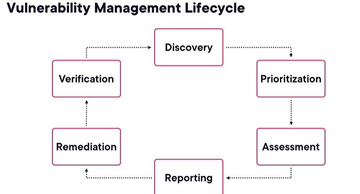
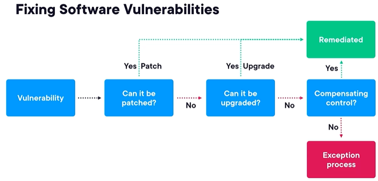

<b>What is a Vulnerability?</b>

## What is a Vulnerability?

A **vulnerability** is a weakness in an information system, system security procedures, internal controls, or an implementation that could be exploited by a threat source. 

Where there is a weakness, there is potentially a **risk** and perhaps a **compliance violation**. Because of this, the management of vulnerabilities is closely aligned with GRC (Governance, Risk, and Compliance).

---

### Role and Placement within the Organization

Depending on the organization, vulnerability management can be structured differently:
* It may be located directly within the GRC team.
* It may be part of another information security team that works very closely with GRC.
* Some organizations have a dedicated **Vulnerability Manager**, while in others, it is just one part of a person's broader job responsibilities.

---

### The Purpose of Vulnerability Management

In an ideal world, vulnerabilities wouldn't exist. However, since they do, it is more sensible to **proactively find and manage them** rather than waiting to be told about them or letting a threat actor find them first.

> **Vulnerability management is the continuous process of finding and fixing vulnerabilities.**

---

### Types of Vulnerabilities

There are two main types of vulnerabilities:

1. **Weaknesses in Software**
2. **Weaknesses in Configuration** (the way software is configured)

*Note on "Software":* This term encompasses any type of software, including:
* Operating systems
* Software running on devices (like firewalls)
* Applications and databases
* Web applications or APIs
* Software you have bought, written yourself, or had written for you.

---

### Fixing Vulnerabilities

* **Software Weaknesses:** 
    - Generally fixed by applying a **patch** (an update that fixes the vulnerability).
* **Configuration Weaknesses:** 
    - Fixed by properly **reconfiguring** the software.

---

### Vendor Disclosure and CVEs

When a software or system vendor discovers a vulnerability, they typically:
1. Publish it on their website and notify customers.
2. Apply to have it added to the **Common Vulnerabilities and Exposures (CVE)** catalog, which assigns it a unique CVE identification number.
3. Produce a patch or a set of technical steps to eliminate the weakness.

**IT operations teams** routinely monitor vendor websites and newsfeeds for vulnerabilities affecting their systems, devices, and software, and will apply the patches or configuration changes provided by the vendor.

<b>Vulnerability LIfecycle</b>

# The Vulnerability Management Lifecycle

New vulnerabilities are discovered constantly, so vulnerability management must be a **continuous process**, not a one-off exercise. While each organization has its own approach, there are normally six phases to the management lifecycle.

---

## Phase 1: Discovery
To manage vulnerabilities, you must know about all the systems and assets in the organization because every system, application, or device could be vulnerable.
*   **Goal:** Build an inventory of systems and assets.
*   **Tools used:** 
    - Network traffic analysis
    - Network scanning
    - Configuration Management Databases (CMDBs)
    - Workstation agents.

## Phase 2: Prioritization
This phase updates the asset list based on how systems **support the business** and the types of data they process.
*   **Goal:** Prioritize fixes based on business impact if a vulnerability is exploited.
*   **GRC Integration:** Relies on GRC's assessment of the impact of a breach (confidentiality, integrity, availability) or compliance violation. Since most organizations have more vulnerabilities than they can fix, **prioritizing** based on potential business impact is crucial.

## Phase 3: Assessment
This is typically where all current vulnerabilities are **discovered**.
*   **Vulnerability Scanner:** 
    - A software application that talks to every visible system/device, checks for vulnerabilities, and builds a database.
*   **CVSS (Common Vulnerability Scoring System):** 
    - A standard way to describe vulnerability seriousness, providing a base score between 1 and 10 based on variables like ease of exploitation.
*   **Ranking:** 
    - Because CVSS is theoretical, managers add intelligence from the prioritization phase (business impact and environment) to rank vulnerabilities accurately.

## Phase 4: Reporting
Reporting is reviewed by the information security committee to ensure the organization stays secure.
*   **Policy Checks:** 
    - Verifying if policy requirements are met (e.g., "All vulnerabilities with a CVSS over 6 on internet-connected systems must be fixed within 7 days").
*   **Trend Analysis:** 
    - The GRC team looks for trends (increasing or decreasing vulnerabilities) to highlight issues like understaffing in operations before they become critical problems.

## Phase 5: Remediation
The first step is to **triage** vulnerabilities into three categories: 
1. Fix
2. Acknowledge (not fix)
3. Investigate furthur

**Ways to remediate include:**
1.  **Configuration:** 
    - Configure the system properly.
2.  **Patching:** 
    - Apply a vendor-supplied patch.
3.  **Upgrading:** 
    - Move to a non-vulnerable software version if patching is dangerous or unavailable.
4.  **Compensating Controls:** 
    - Ask security engineering to create controls that reduce the likelihood of exploitation.
5.   **Exceptions:** If a vulnerability cannot be remediated but policy dictates it should be, the manager works with GRC to create an exception via the formal variance management process.

## Phase 6: Verification
The final phase is to verify that any patches, configuration changes, or compensating controls have actually worked and the vulnerability no longer exists.
*   **Validation:** Normally done by running the vulnerability scanner again.

**Di.P.A.R.R.V**

---

## Penetration Testing
Vulnerability scanning is not the only discovery method. Organizations also commission **penetration tests** to simulate a real threat actor, discovering vulnerabilities that scanners might miss.

## The Importance of GRC (Course Wrap-up)
GRC answers **what** information security an organization should do and **why**. 
*   It checks that the organization is actually doing the security it committed to.
*   It puts mechanisms in place to detect and rectify problems before they become business problems.
*   Without GRC, security is left to individual whims, offering no assurance that risk tolerance or legal/contractual obligations are met.

