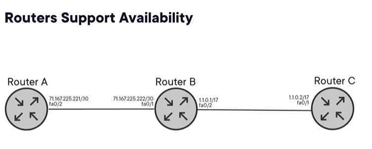

<b>Security, Architecture, and Engineering</b>

## The True Meaning of Security

Knowing the tools, objectives, and roles of organizational security, architecture, and engineering is imperative to protect digital assets against ever-growing threats. 

Cybersecurity professionals often have a blind spot: a singular focus on **confidentiality** (securing data by hiding it and putting access controls around it). However, seminal cybersecurity architecture frameworks show that confidentiality is only one of three required elements for holistic security.

### The Security Triad (CIA)

Security is not simply saying "no" regarding confidentiality; it is often figuring out how to say "yes." 

1. **Confidentiality:** 
    - Restricting access to data.
2. **Integrity:** 
    - Providing the veracity and accuracy of data. "Public" data doesn't mean it is not important
3. **Availability:** 
    - Ensuring data is accessible when needed.

> **The Public Data Example:** Imagine a severe weather report warning labeled as "public." Someone might assume that public data has very little value. But this data could save human lives, giving it the highest value. Assuming minimal value just because everyone can access it leaves out essential controls for integrity and availability.

---

## Architecture vs. Engineering

Security controls from a broad perspective are related to **architecture**, while security related to specific implementation is tied to **engineering**.

There is a significant delineation between the two:

* **The Risk of Engineering First:** 
    - If engineering begins before (or in place of) architecture, the intent is likely to fail to satisfy the organization's objectives. The protection will not span the attack surface of the adversary's focus. 
* **The Construction Analogy:** 
    - Imagine skilled construction workers building a new facility without architectural plans. Interpretations are left to individual actions, and the intended architecture won't be represented in the final building.

---

## The Value of Proper Architecture

**Proper architecture ensures that technological solutions are effective, efficient, and scalable.**

A well-defined architecture should:
* Accommodate future growth and change.
* Be flexible enough to adapt to new requirements and emerging technologies.
* Be considered a **strategic path** to answering business problems and opportunities.

<b>Security Architecture Frameworks</b>

# Architectural Frameworks Timeline

There are several seminal architectural frameworks that could be used within an organization. These frameworks are worth further investigation to identify which one best fits your business needs.

## 1987: The Zachman Framework
*   **Origin:** 
    - The initial framework in the timeline, not explicitly designed with security as the goal.
*   **Structure:** 
    - A matrix-based framework providing a structured way of thinking about enterprise architecture. 
*   **Function:** 
    - Defines six different perspectives of enterprise architecture, each with questions that need answering to understand and design the system. 
*   **Impact:** 
    - The inspiration for many modern-day security architectures. Allows organizations to gain a complete, holistic understanding of their enterprise architecture and develop solutions aligned with business needs.

## 1995: TOGAF (The Open Group Architecture Framework)
*   **Objective:** 
    - Enables organizations to create architecture aligned with their business goals.
*   **Features:** 
    - Supports objectives that are adaptable and flexible to changing business needs.
*   **Value:** 
    - Ensures emerging technologies are cost-effective and efficient to implement and manage.

## 1995: SABSA (Sherwood Applied Business Security Architecture)
*   **Objective:** 
    - Provides a comprehensive and integrated approach to security architecture that supports an organization's business goals and objectives.

## 1996: COBIT (Control Objectives for Information and Related Technologies)
*   **Origin:** 
    - Designed by the ISACA organization.
*   **Function:** 
    - An IT Governance framework that provides a set of best practices for managing controls for information technology resources.
*   **Objective:** 
    - Aims to provide a comprehensive and integrated approach to IT governance that enables organizations to align their IT investments with their business objectives.

## 2005: ISO 27001
*   **Function:** 
    - Created the Information Security Management System (ISMS). The accompanying controls in **ISO 27002** serve as a code of practice.
*   **Objective:** 
    - Aims to provide a comprehensive and integrated approach to information security management.
*   **Value:** 
    - Helps organizations protect their information assets, manage risk, comply with legal and regulatory requirements, and achieve continuous improvement.

## 2014: NIST Cybersecurity Framework
*   **Objective:** 
    - Designed to manage cybersecurity risks **consistently and in a standardized**, effective manner.
*   **Features:** 
    - Flexible and adaptable to meet the specific needs of different organizations.
*   **Value:** 
    - Provides a common language and set of standards for cybersecurity in both the public and private sectors.

## 2015: MITRE ATT&CK Framework
*   **Objective:** 
    - A framework for understanding and categorizing the **Tactics, Techniques, and Procedures (TTPs)** used by attackers to compromise and infiltrate computer networks.
*   **Value:**
    - Designed for the development of defensive security architectures.

<b>Security Engineering</b>

## The Role of Security Engineering

Security engineering uses the organization's architecture to accomplish the implementation of security controls. It involves designing and implementing security measures to protect systems, networks, and data from unauthorized access, theft, damage, or disruption.

*   **Tools and Techniques:**
    - encryption
    - access controls
    - firewalls
    - intrusion detection and prevention systems
    - security policies.
*   **Implementation Principle:**
    - Controls should be implemented in a **default deny** state. 
*   **The Security Triad:**
    - To fully address the security triad (Confidentiality, Integrity, Availability), engineering must also include backup and recovery controls.

---

## Control Classifications: Active vs. Passive

Security engineering controls can be grouped into two contrasting classifications (or tool families):

### 1. Active Controls
*Also known as: Interactive or Action-based tools.*
*   **Function:** Enforces directive, preventive, corrective, deterrent, and compensating controls.
*   **Car Analogy:** The steering wheel, accelerator, and brakes.
*   **Examples:** Firewalls, cryptography, VPNs, and access controls.
*   **Primary Objective & Outcome:** Confidentiality; preventing unauthorized access.

### 2. Passive Controls
*Also known as: Non-interactive or Observational tools.*
*   **Function:** Mainly used for detective controls.
*   **Car Analogy:** The speedometer and fuel gauge.
*   **Examples:** Intrusion detection, activity monitoring, and log management tools.
*   **Primary Objective & Outcome:** Integrity; detecting issues.

> **Note:** Both active and passive controls are necessary for safe and secure travel.

---

## Deployment Environments

Security engineering tools can appear in different environments, changing the scope of the engineer's responsibilities:

*   **On-Premises (Traditional):** In a traditional data center with hardware devices, the security professional must install, configure, and update both the physical and logical systems.
*   **Cloud (Environment as a Service):** In an abstracted, virtualized cloud environment, everything except the physical infrastructure is left to the Cloud Service Provider. However, the Cloud Service Customer must still retain the expertise of a security engineer to configure the services according to business requirements.

<b>Security Engineering - Availability and Integrity Components</b>

## Evaluating Security Engineering Components

When considering the elements of security engineering, we reflect on the general objectives and specific outcomes desired for primary components. 
*   **Evolution:** 
    - Over time, with the growth of technology capabilities, the separation of functions between components has become less discrete. Most components can accomplish multiple objectives and may not be perfectly segregated within the CIA triad.
*   **Focus:** 
    - Despite this overlap, we will focus on the **primary objectives** (using their base definitions) for these components, specifically looking at **availability** and **integrity**.

---

### 1. Routers
*   **Primary Objective:** Availability (interconnecting networks within an organization and across the internet).
*   **Secondary Objective:** Allowing or disallowing access via access controllers (preventive capabilities restricting traffic from specific IP ranges and services).
*   **Protocols Used:**
    *   **Interior Gateway Protocols:** Manage internal organization routing.
    *   **Exterior Gateway Protocol:** Manage interconnection across the internet.
*   **Autonomous Systems:** A family of linked routers that shares a common routing policy. 
*   **Routing Methods:**
    *   **Distance Vector Protocol:** Tracks the hop count from one network to another.
    *   **Link-State Protocol:** Evaluates additional conditions to determine the proper path the router must take.
*   **Function:** Acts as the primary traffic arbiter between the public IP address (the internet) and the gateway of the private IP address (the local subnetwork).

---

### 2. Load Balancers
*   **Primary Objective:** Availability.
*   **Desired Outcome:** Enhancing performance by distributing incoming network traffic across multiple servers or resources to prevent any single component from becoming overloaded.
*   **Function:** Acts as a compensating control to optimize performance and ensure the system remains available and responsive during high-traffic periods or heavy loads. They also help accomplish fault tolerance.
*   **Mechanism:** Facilitated using a **reverse proxy** that handles client requests and distributes them to back-end systems based on performance settings and system availability.

---

### 3. Backup and Recovery Tools
*   **Primary Objective:** Availability and Integrity.
*   **Storage Mediums:** Tapes, hard drives, solid-state drives, cloud backup systems, and dedicated off-site storage.
*   **Tape Drives:** 
    *   A traditional backup strategy offering high capacity.
    *   Cost-effective for long-term archival storage. 
    *   Stores backups offline using magnetic tape cartridges, which protects against online threats like ransomware.
*   **Cloud Storage:** 
    *   Increasingly popular for remote off-site storage (e.g., Amazon S3, Microsoft Azure Blob storage, Google Cloud Storage, or Dropbox).
    *   **Benefits:** Offers scalable ease of access and the ability to store backups in geographically dispersed locations for added redundancy.

<b>Security Engineering Confidentiality Components</b>

# Security Engineering: Confidentiality Components

## 1. Firewalls
The primary objective of a firewall is **confidentiality**, with the desired outcome of allowing or preventing data flows. 

### Firewall Classifications:
*   **Packet Filter Firewalls:** 
    - The most basic type. They examine data packets traveling between networks and filter them based on preconfigured rules (e.g., source/destination IP addresses, ports, and protocols).
*   **Stateful Inspection Firewalls:** 
    - Also known as *dynamic packet filtering firewalls*. They combine packet filtering and session monitoring to keep track of the state of connections between devices, only allowing traffic that is part of an established session.
*   **Application-Level Firewalls:**
    - Also known as *proxy firewalls*. Operating at the application layer of the OSI model, they examine the content of data packets. They provide additional security features like content filtering, user authentication, and intrusion detection.
*   **Next-Generation Firewalls (NGFW):** 
    - Combine traditional firewall features with advanced security technologies (e.g., intrusion prevention, antivirus, and web filtering) to provide comprehensive protection against modern threats like malware and targeted attacks.
*   **Cloud Firewalls:** 
    - Similar to traditional firewalls but specifically designed to protect applications and data hosted in cloud environments.

---

## 2. Intrusion Detection and Prevention Systems (IDS / IPS)
These act as compensating controls alongside firewalls.
*   **Primary Objective:** Maintaining the **integrity** and **confidentiality** of an environment.
    **A. Intrusion Prevention System (IPS):** The desired outcome is the *active disruption* of malicious traffic.
    **B. Intrusion Detection System (IDS):** The desired outcome is the *notification* of malicious activity.

---

## 3. Virtual Private Networks (VPNs)
*   **Primary Objective:** 
    - **Confidentiality** (maintained by the private encryption component) and **Availability** (maintained by the virtual network component).
*   **Access Methods:** 
    - Can be accessed using x.509 digital certificates, VPN software tools, and hardware devices.

---

## 4. Data Loss Prevention (DLP) Tools
*   **Function:** More granular than IDSs and IPSs because they manage specific data objects.
*   **Primary Objective:** **Confidentiality** and **Integrity**.
*   **Desired Outcome:** Prevention of access, detection of access, and the detection of changes in objects.

---

## 5. General Monitoring Tools
These tools cover the full spectrum of security objectives (Confidentiality, Integrity, Availability), but their primary focus is **Integrity**. Examples include:
*   **SNMP (Simple Network Management Protocol):** Used for network monitoring systems.
*   **IPMI (Intelligent Platform Management Interface):** Implemented in microcontrollers to monitor the full capabilities of all components within a server.
*   **JMX (Java Management Extensions):** Allows for monitoring and managing various aspects of Java applications (e.g., memory usage, CPU utilization, thread count, and other metrics).

<b>Integration of Security Engineering Components</b>

## The Hybrid Approach to Security
When considering the integration of security engineering components, there is no one-size-fits-all approach. Implementations differ based on the business requirements defined in the architecture.
*   Many organizations have **mixed solutions or hybrid approaches** to consuming and protecting data.
*   Security will also be hybrid, orchestrating on-premises and cloud resources to work cohesively.
*   This hybrid cohesion is typically accomplished using **Edge Computing**, **CASB**, and **SASE** services.

---

## 1. Edge Computing
Recall that holistic security includes availability, and a key component of availability is performance. Edge computing provides this performance.
*   **Definition:** A decentralized computing model where data processing and computation are done closer to the data source (at or near the edge of the customer's network).
*   **Benefits:** Reduces the need to transmit data back and forth to remote centralized cloud data centers.
*   **Outcomes:** Enables faster response times, lowers latency, and reduces data transmission costs. It is well-suited for real-time or near-time processing and analysis.

---

## 2. CASB (Cloud Access Security Broker)
*   **Definition:** A security solution that acts as a gatekeeper between an organization's on-premise infrastructure and the Cloud Service Provider (CSP).
*   **Function:** Provides visibility and control over cloud-based applications, data, and infrastructure.
*   **Features:** Allows users to access resources using encryption, tokenization, and other Data Loss Prevention (DLP) services.

---

## 3. SASE (Secure Access Service Edge)
While CASB focuses primarily on securing cloud applications and data, SASE is a broader framework.
*   **Function:** Encompasses network security *inclusive* of a CASB.
*   **Scope:** Controls all traffic (including to and from cloud applications and data), regardless of location or device.
*   **Implementation:** It is a **Zero Trust** type of implementation, requiring authentication and authorization for all traffic.

---

## Segmentation and Micro-Segmentation
As important as interoperability is to support integrity and availability, it is equally vital for engineering to support **segmentation**.
*   **Purpose:** Helps maintain a "blast radius" to contain security breaches or incidents, preventing them from spreading across the entire organization's systems.
*   **How it Works:** Involves limiting communication and control paths between discrete systems, and even micro-segmentation of the same system within a discrete service.
*   **Default Deny:** Isolation requires a *default deny* path of implementation. When a path is open, it is opened explicitly to specific entities, for specific purposes, for a particular time.

---

## Zero-Trust Architecture
The behaviors described above, including micro-segmentation, are vital tenets of Zero-Trust architecture.
*   **Core Principle:** All access to resources in a Zero-Trust environment is treated as a potential breach.
*   **Traffic Scrutiny:** 
    *   **North-South Traffic:** Traffic from the internet to your private network is treated as untrusted.
    *   **East-West Traffic:** Traffic within your network (lateral traffic) is scrutinized similarly.
*   **Replacing Perimeters:** Organizations can use Zero Trust to replace traditional perimeter controls (like VPNs) with policy enforcement and decision points (e.g., routing all remote users through proxies).
*   **Real-World Example:** *BeyondCorp* is a practice put to use by Google that allowed them to eliminate the use of the VPN in 2014.

