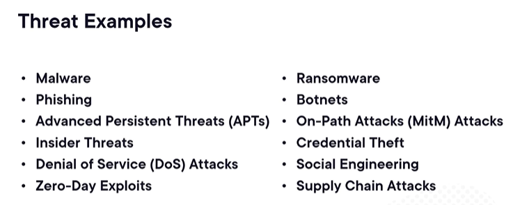
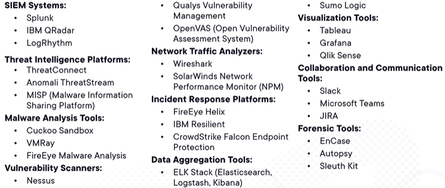
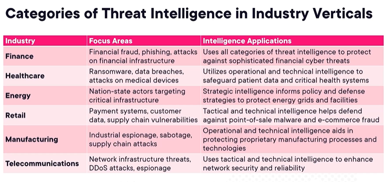
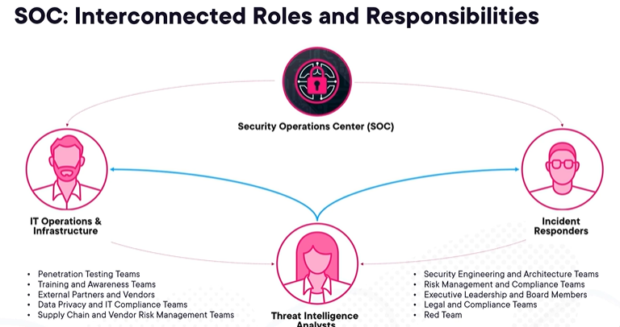
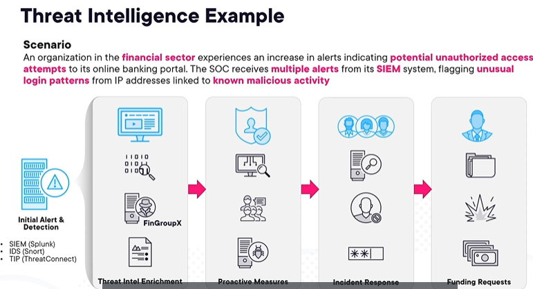

<b>Specific Types of Threats</b>

## Definition of a Threat
A **threat** is a possible danger that can be used to exploit an existing vulnerability via a breach with the intent to cause harm to systems, to networks, or to entire organizations. 
*   **Sources:** Threats can come from external or internal sources.
*   **Intent:** They can be intentional (caused by bad actors) or accidental.

---

## Six Scenarios Highlighting Types of Threats

### 1. Physical Damage
As the name implies, this involves physical damage happening to hardware, data centers, or computers in a network. This causes outages, a degradation in service, or loss of data.

### 2. Natural Events
Things like tornadoes, hurricanes, or floods. These are not planned or caused by a bad actor, but they still create massive damage, outages, and disruptions to business.

### 3. Technical Failures
Hardware fails and things break. These technical breakdowns create unpredictable outages and disruptions to business.

### 4. Compromise of Information
Data breaches that leak information, steal intellectual property, or expose trade secrets. 
*   *Impact:* Attackers could destroy things to take the organization offline, or they might steal information surreptitiously to gain a competitive advantage. This can originate internally or externally.

### 5. Compromise of Functions
Occurs when a bad actor group compromises a network or its systems to disrupt operations.
*   *Example:* The Natanz nuclear facility breach. SCADA systems were compromised, causing the centrifuges within the nuclear reactor to spin up out of control, overheat, and sustain damage, thereby compromising the function of the entire facility.

### 6. Loss of Essential Services
This involves the loss of critical services (such as 911 dispatch or a customer call center). It impacts overall business continuity, the ability to do business, and the ability to interact with customers.

<b>Gathering and Correlating Information</b>

## Threat Examples

## The Need for Context in Security Data
Threats come from all directions—internal, external, bad actors, and natural events. A Security Operations Center (SOC) faces a wide variety of attacks daily, making **threat intelligence** critical for mitigating these threats and reducing their overall impact.

In day-to-day operations, information flows in from numerous sources:
*   Alerts
*   Logs
*   Other raw data

Without context, this data is extremely difficult to interpret. Analysts face the challenge of finding the "needle in the haystack," determining exactly what data is valuable and what is just noise.

## The Role of the Threat Intelligence Analyst
To make raw data actionable, a threat intelligence analyst must pull information from these varied sources to **correlate and enrich** the data. 

### Key Objectives of the Analyst:
*   **Data Processing:** 
    - Categorize data and enrich alerts with necessary context.
*   **Threat Hunting:** 
    - Track, target, and either deter or prevent attacks.
*   **Understanding TTPs:** 
    - Identify the Tactics, Techniques, and Procedures (TTPs) used by bad actors.
*   **Mitigation:** 
    - Use this correlated intelligence to take threats offline or mitigate their impact as much as possible.

<b>Strategic, Tactical, and Operational Intelligence</b>

When categorizing threat intelligence, it is broken down into three main types based on its scope, timeframe, and the teams involved. 

## 1. Tactical Cyber Intelligence
*   **Focus:** 
    - Immediate or specific threats and incidents. It requires an immediate, tactical response.
*   **Involves:**
    - Real-time monitoring, analysis, and response to cyber threats. It deals with the day-to-day operations of detecting and mitigating threats.
*   **Teams Involved:**
    - Security Operations Center (SOC) analysts, incident response teams, network and IT administrators, and frontline security personnel.
*   **Action:**
    - Identifying and containing security incidents as they occur.

## 2. Operational Cyber Intelligence
*   **Focus:**
    - Trends and patterns over a period of time.
*   **Involves:**
    - A deeper analysis of cyber threats and risks to understand the attackers' Tactics, Techniques, and Procedures (TTPs). It also involves identifying vulnerabilities and weaknesses in the organization's defenses.
*   **Teams Involved:**
    - Threat intelligence analysts, vulnerability management teams, penetration testers, red teams, and security engineers.
*   **Action:**
    - Analyzing threat data, conducting risk assessments, and implementing measures to strengthen the organization's overall security posture.

## 3. Strategic Cyber Intelligence
*   **Focus:**
    - Long-term planning and decision-making.
*   **Involves:**
    - Forecasting future threats and trends, understanding the broader cyber threat landscape, and providing insights to support strategic decision-making at the highest organizational level.
*   **Teams Involved:**
    - Chief Information Security Officers (CISOs), senior management, risk management committees, and the board of directors.
*   **Action:**
    - Utilizing strategic intelligence reports and assessments compiled by the other teams to allocate resources, set policies, establish budgets, request funding, and prioritize security initiatives.

<b>Common Tools, SIEM Systems, and How Intelligence Adds Value</b>

## Common Threat Intelligence Tools
While specific tools are often used by analysts, it is important to familiarize yourself with the landscape of available tools without strictly endorsing one over another. *(Note: Reviewing common industry tools will help you understand what you may come across in a SOC environment).*

## SIEM Systems (Security Incident and Event Management)
SIEM systems are critical tools for a threat intelligence analyst. 
*   **Data Aggregation:** 
    - They take data from numerous areas—such as application data, network data, storage, firewalls, and compute—and aggregate it into a common dashboard.
*   **Anomaly Detection:** 
    - Allows analysts to see how things are functioning at any point in time and spot anomalies (e.g., a massive spike in network traffic, compute usage, or firewall hits).
*   **Noise Filtering:** 
    - SIEM systems filter out what is just "noise" and what is actually actionable intelligence.

## How Threat Intelligence Adds Value
Threat intelligence provides significant value to an organization across several key areas:

### 1. Identifying
Allows the organization to quickly identify the top threats it is facing.

### 2. Research
Helps teams understand the methods of attack for each threat. This can involve:
*   Open-Source Intelligence (OSINT)
*   Human Intelligence (HUMINT)
*   Frameworks like the MITRE ATT&CK framework.

### 3. Decision Making
Enables teams to develop assumptions on the most likely primary and secondary attacks. 
*   **Resource Allocation:** 
    - Since organizations have limited resources (time, personnel, and funding), intelligence helps prioritize and direct these resources where they are most appropriate and will have the greatest impact on strengthening the security posture.

### 4. Covering Gaps
Helps map intelligence to existing organizational weaknesses so teams can develop defenses, deter threats, and mitigate risks (effectively finding and closing the "open doors and windows" in the environment).

<b>Security Operations Maturity Levels</b>

## Overview
As an organization's security capabilities, tooling, and resiliency mature, they progress through different security operations maturity levels—moving from tactical, to operational, and finally up to strategic intelligence.

## 1. Initial (Basic Threat Awareness)
*   **Characteristics:** 
    - Organizations typically have basic security measures in place, such as antivirus and basic network monitoring.
*   **Threat Intelligence Function:**
    - Serves to raise awareness about common threats and vulnerabilities relevant to the organization's industry and technology landscape.
*   **Value:**
    - Helps in understanding immediate threats and provides early warnings to prevent basic cyber incidents.

## 2. Intermediate (Structured Security Operations)
*   **Characteristics:**
    - Organizations have established Security Operations Centers (SOCs) and formal incident response policies and processes.
*   **Threat Intelligence Function:**
    - Integrated into SIEM systems and incident response workflows to enhance detection and response capabilities.
*   **Value:**
    - Improves the accuracy and speed of threat detection, allowing for more proactive threat hunting and mitigation.

## 3. Advanced (Proactive and Adaptive Security Measures)
*   **Characteristics:**
    - Organizations have matured to a state where they can proactively hunt for threats and continuously adapt their defenses based on intelligence to strengthen their security posture.
*   **Threat Intelligence Function:**
    - Feeds into predictive analytics models and advanced threat hunting techniques to identify sophisticated threats early.
*   **Value:**
    - Enables proactive defense strategies (threat anticipation, rapid response to emerging threats) and strategic decision-making based on comprehensive threat insights.

## 4. Strategic (Integrated Risk Management and Business Alignment)
*   **Characteristics:**
    - The highest level. Cybersecurity is integrated into the overall business strategy and risk management frameworks.
*   **Threat Intelligence Function:**
    - Informs strategic decision-making at the executive level, guiding investments in cybersecurity technologies and resources.
*   **Value:**
    - Aligns cybersecurity efforts with business goals, supports regulatory compliance, and enhances resilience against targeted and Advanced Persistent Threats (APTs).

<b>Categories of Threat Intelligence in Industry Verticals</b>

## Industry-Specific Threat Focus
Various industries face different types of threats and therefore have different focus areas for their security operations. While threats can come from all directions (internal, external, etc.), the application of threat intelligence must be tailored to the specific vertical.

### 1. Finance Industry
*   **Focus Areas:** 
    - Financial fraud, phishing attacks, and attacks on financial infrastructure.
*   **Threat Intelligence Application:**
    - Uses all categories of threat intelligence (tactical, operational, and strategic) to protect against highly sophisticated financial cyber threats. 
*   **Requirements:**
    - As a prime target, the banking and financial services sector requires highly advanced and mature cybersecurity infrastructure and threat intelligence analysis.

### 2. Healthcare Industry
*   **Focus Areas:**
    - Ransomware, data breaches, and attacks on medical devices.
*   **Threat Intelligence Application:**
    - Utilizes **tactical and operational** intelligence heavily to safeguard patient data and critical health systems.
*   **Requirements:**
    - A strong focus on dealing with things in real-time to mitigate threats *before* they have a chance to affect patient care, medical devices, or patient health records.

<b>SOC: Interconnected Roles and Responsibilities (Threat Intelligence Perspective)</b>

## The Threat Intelligence Perspective
While the Security Operations Center (SOC) encompasses many roles, a **Threat Intelligence Analyst** continuously collaborates with specific teams to enrich alerts, provide additional context, and help remediate threats quickly.

### The Broader SOC Umbrella
A Threat Analyst operates within a large ecosystem that includes:
*   Penetration testing teams
*   Training and awareness teams
*   External partners and vendors
*   Data privacy and IT compliance teams
*   Supply chain and vendor risk management teams

---

## Key Collaborative Partnerships

### 1. General SOC Teams
*   **Relationship:** 
    - Crucial partners for monitoring, detecting, and responding to security events.
*   **Analyst Contribution:**
    - Providing threat intelligence, incident analysis, and recommendations for improving detection and response capabilities.

### 2. Incident Response (IR) Teams
*   **Relationship:**
    - Work closely during active security incidents to investigate, contain, and remediate threats.
*   **Analyst Contribution:**
    - Providing detailed threat analysis, forensic evidence, and actionable recommendations for mitigating future incidents.

### 3. IT Operations and Infrastructure Teams
*   **Relationship:**
    - Essential partners because they implement security controls, manage vulnerabilities, and ensure the overall security posture of systems and networks.
*   **Analyst Contribution:**
    - Collaborating to assess and prioritize risks, implement security measures, and optimize security configurations.

---

## The Collaborative Loop
The SOC operates collaboratively, constantly feeding information back and forth between teams:
*   **Rapid Response:**
    - Working together ensures threats are identified and remediated as quickly as possible.
*   **Continuous Improvement:**
    - Data is continuously gathered to enrich alerts and understand emerging threats.
*   **Proactive Mitigation:**
    - This constant feedback loop puts things in place to mitigate future threats *before* they ever have a chance to attack the environment.

<b>Enriching Alerts with Threat Intelligence</b>

## Scenario Overview
Integrating threat intelligence profoundly enhances an organization's capacity to detect, respond to, and mitigate cyber threats. 

**The Example Scenario:** An organization in the financial sector experiences a surge in alerts indicating potential unauthorized access attempts to its online banking portal. The SOC receives multiple alerts from its SIEM system flagging unusual login patterns from IP addresses linked to known malicious activity.

---

## 1. Initial Alert and Detection
*   **The Alert:** 
    - The SIEM system generates alerts for multiple failed login attempts from flagged IP addresses.
*   **Enrichment:** 
    - Analyzing the threat intelligence data reveals that the IPs are associated with a threat group called **FinGroupX**, notorious for targeting financial institutions.
*   **TTPs Identified:**
    - Intelligence reveals that FinGroupX employs *credential stuffing attacks*, leveraging stolen credentials from previous breaches.

## 2. Proactive Measures
*   **Enhanced Monitoring:**
    - The SOC increases monitoring on online banking systems and deploys additional rules in the SIEM system to detect patterns consistent with FinGroupX's known TTPs.
*   **User Notifications:**
    - The organization sends a precautionary notification advising customers to reset passwords and enable Multi-Factor Authentication (MFA).
*   **Internal Security Posture:**
    - IT teams review and reinforce security measures on the banking infrastructure, conduct vulnerability assessments, and patch any identified vulnerabilities.

## 3. Incident Response
*   **Investigation:**
    - The Incident Response (IR) team is activated to perform a forensic analysis to determine if any unauthorized access was actually successful.
*   **Containment:**
    - Any compromised user accounts are locked, and additional security measures are applied to lock down the environment.
*   **Remediation:**
    - The organization resets affected customer passwords and implements stricter rate limiting on login attempts to prevent future credential stuffing attacks.

## 4. Funding and Resource Requests
The CISO prepares a detailed report to justify the need for additional funding and resources. The report includes:
*   **Attack Details:** 
    - The nature of the attack, FinGroupX's TTPs, and the tools used.
*   **Business Impact:** 
    - Potential and actual impact on customer trust, financial loss, and brand reputation.
*   **Proactive Actions Taken:** 
    - Enhanced monitoring, customer notifications, and internal security measures.
*   **Resource Needs (Funding Request):** 
    *   Investments in advanced threat intelligence platforms for real-time data enrichment.
    *   Hiring additional SOC analysts and incident responders to handle increased alert volumes.
    *   Upgrading security infrastructure (better IDS/IPS systems, robust authentication mechanisms).
*   **Metrics and KPIs:** 
    - Included or developed to formally justify the added resources.

---

## Example Toolset Used in this Scenario
*(Note: These are examples of commonly used tools, not specific endorsements.)*
*   **SIEM System:** Splunk
*   **IDS/IPS:** Snort
*   **Threat Intelligence Platforms:** ThreatConnect, Anomali ThreatStream
*   **Forensics Tools:** EnCase, Wireshark
*   **Communication:** Slack, Microsoft Teams

---
*Course Wrap-Up: This concludes the course! For a deeper dive into these topics, consider exploring full CompTIA Security+ certification preparation materials.*

