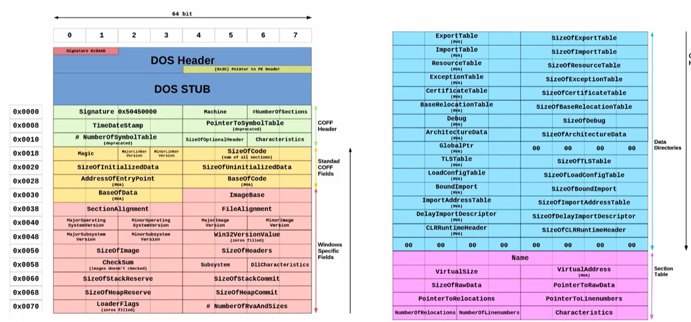
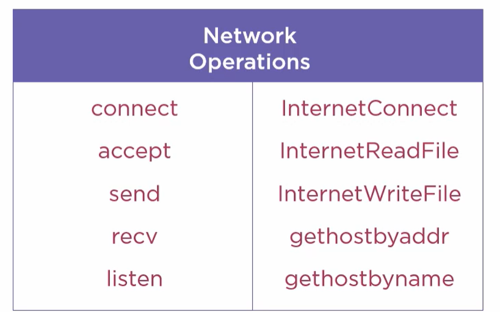
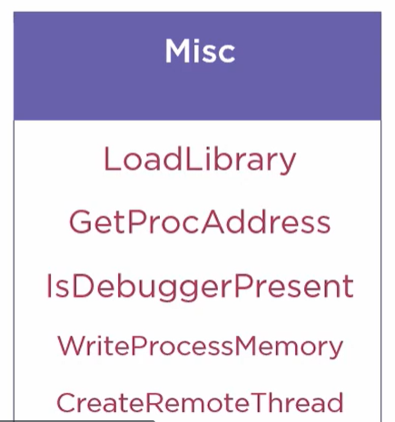
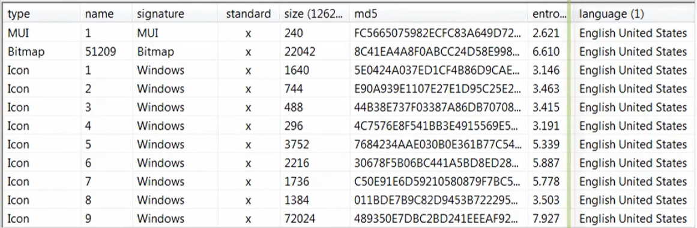
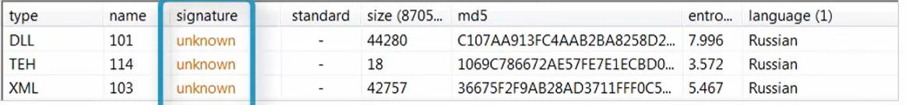
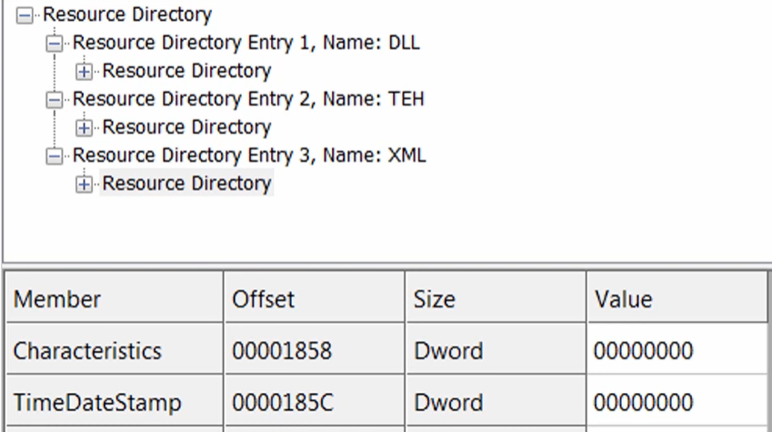

Introduction

## Windows PE Header

- The **Windows PE header** provides the operating system information it needs to run the program.
- Key pieces of information can help determine:
  - How the malware **interacts with the computer**.
  - **When** it may have been created.
  - Possibly **where** it came from.
- Timestamps and location-related information can help with **attribution**, but must be supported by other evidence.

Windows PE Header

## Purpose of the PE Header

- Contains the information necessary for **Windows to execute the program**:
  - What DLLs to load.
  - What portions contain executable code and data.
  - What instructions to start at.
  - Whether the program uses a GUI, console, or another subsystem.
- Tells the OS where the pieces of the executable go in memory:
  - Where to put the different sections.
  - How large they should be.
  - What their purpose is.

  

## Key Areas for Malware Analysis

| Area | Information to examine |
|---|---|
| **File header** | `TimeDateStamp` |
| **Optional header** | Subsystem |
| **Sections** | Names and characteristics |
| **Import address table** | Libraries and functions |
| **Resources** | Contents, language, and timestamps |

## File Header: TimeDateStamp

- The **TimeDateStamp** is normally set when the program is built.
- Represents seconds since **January 1, 1970, at 00:00 UTC**.
- Most analysis tools convert this value for you.
- It can provide a clue about **how old the malware is**:
  - A recent timestamp could indicate a **new variant** or **dynamically generated malware**.
- **Nothing ensures this field is correct.**
- Attackers and packers may modify it.
- Use it as **one piece of information**, not the sole source for determining the malware’s age.

## Optional Header: Subsystem

- The optional header contains more information the OS needs to run the executable.
- Despite its name, it is required for executable images.
- The **subsystem** tells what kind of interface or execution environment the executable needs:
  - Windows console.
  - Windows GUI.
  - Native subsystem, commonly associated with drivers.
  - Other supported environments.
- This helps determine what to expect during **dynamic analysis**.

PE Sections

## What Are Sections?

- Executables are divided into portions with different purposes:
  - **Executable code**
  - **Data**
  - Other things the executable needs when it runs.
- These portions are called **sections**, and their definitions are stored in the PE header.
- Examine their **names** and **characteristics**.

## Common Section Names

| Section | Typical purpose |
|---|---|
| `.code`, `.text` | Executable code |
| `.data`, `.rdata` | Data |
| `.idata` | Import information |
| `.edata` | Export information: functions the file offers |
| `.rsrc` | Resources |

- Most section names are strings and start with a dot.
- Names can also be **binary data** or **empty**.
- Section names are clues; they do not guarantee the contents.

## Section Characteristics

| Characteristic | Meaning |
|---|---|
| **Read** | The section can be read from. |
| **Write** | The section can be written to. |
| **Execute** | Code in the section can be executed. |
| **Initialized data** | May contain strings worth examining. |
| **Uninitialized data** | Space for data initialized during execution. |

## Detecting Packers

- Look for unusual section names:
  - Random names.
  - Binary names.
  - Empty names.
  - Names associated with known packers.
- UPX-associated names discussed in the course include:
  - `UPX0`
  - `UPX1`
  - `UPX2`
  - `UPX!`
- Look for **odd section permissions**, especially sections that are both **writable and executable**.
- Packers may use these sections to place unpacked code into memory.
- These are **indications of packing**, not proof by themselves.

Import Address Table

## What Is the IAT?

- The **import address table**, or **IAT**, helps the program call functions from dynamically linked libraries.
- Examining imports reveals libraries and APIs the program may use to:
  - Interact with the computer.
  - Send data over the network.
  - Modify files or the registry.
  - Perform other operations.
- This provides clues about the malware’s **functionality**.

## How Imports Work

1. The executable specifies DLLs and functions it needs.
2. Windows loads the required libraries.
3. The loader resolves the functions’ memory addresses.
4. Those addresses are placed in the **IAT**.
5. The program uses these addresses when calling the functions.

- Example functions from `Kernel32.dll`:
  - `VirtualAlloc`
  - `ReadFile`
  - `WriteFile`

## Imports by Name or Ordinal

- Functions can be imported by **name** or **ordinal**.
- An **ordinal** is a numeric identifier for an exported function.
- Imports by ordinal may show a number instead of a function name.
- Packers and malware authors may use ordinals to make analysis harder.
- Analysis tools may resolve the corresponding names.

## Common APIs

| Category | APIs | Possible functionality |
|---|---|---|
| **Memory operations** | `VirtualAlloc`, `VirtualProtect`, `VirtualFree` | Allocate memory, change protection, or free memory. |
| **File operations** | `CreateFile`, `ReadFile`, `WriteFile`, `DeleteFile` | Open, create, read, write, or delete files. |
| **Registry operations** | `RegSetValueEx`, `RegSetKeyValue` | Write to the registry. |
| **Networking** | `listen` | Listen for incoming connections; potentially relevant to a backdoor. |
| **Dynamic loading** | `LoadLibrary`, `GetProcAddress` | Load libraries and resolve functions while running. |
| **Anti-analysis** | `IsDebuggerPresent` | Check whether the process is being debugged. |
| **Process injection** | `WriteProcessMemory`, `CreateRemoteThread` | Often used together in process injection. |

- Networking Operations to take note of

## Important API Limitations

- **CreateFile does not necessarily create a new file.**
  - It can also open an existing file.
  - Behavior depends on the parameters passed to it.
- Imports show **possible capabilities**, not proof that an operation occurs.
- If an API is unfamiliar, look up its documentation.
- Different functions may perform similar operations.

## Dynamically Loaded Functions

- `LoadLibrary` and `GetProcAddress` allow functions to be resolved **while the program is running**.
- These functions do not all need to appear in the static imports.
- Malware may use this to hide functionality from static analysis.
- **An API missing from the IAT does not mean the malware lacks that capability.**

## Detecting Packers Through Imports

- Packers often replace the original import information with a **much smaller set.**
- Look for **very few imported functions**, particularly:
  - `LoadLibrary`
  - `GetProcAddress`
  - `VirtualAlloc`
- A small import table containing mainly these functions is a **packing clue**.

## Exceptions and Misleading Imports

- **.NET programs** may naturally have a very small native import table:
  - Common example: `mscoree.dll` and `_CorExeMain`.
  - A small table alone does not prove packing.
- Malware may import functions it **never calls** to make its import table look more legitimate.
- Unrelated imports, such as sound or video functions, may deserve investigation.
- Evaluate imports alongside other evidence.

Resources

## What Are Resources?

- Resources hold items the program needs outside its main code and data.
- Common examples:
  - **Icons**
  - **Images**
  - **Menus**
- Malware may also store:
  - Hidden executables.
  - Configuration files.
  - Benign documents used as decoys.

## Hidden Executables and Decoy Documents

- An embedded executable found through strings analysis may be stored as a **resource**.
- A Trojan disguised as a document may:
  1. Execute malicious behavior.
  2. Display a benign document stored in its resources.
- This helps trick the user into thinking the file behaved normally.

## Resource Information

| Field | Meaning |
|---|---|
| **Type** | What kind of resource it is. |
| **Name** | A logical name or identifier. |
| **Size** | Size of the resource. |
| **Language** | Language associated with the resource. |
| **Timestamp** | May provide another timing clue, if set. |

- Fields such as **signature, MD5, and entropy** may be calculated by the analysis tool.

## Language as an Attribution Clue

- Resources support **internationalization**, allowing programs to use different languages.
- If a language is not explicitly specified, some build environments may supply a default.
- Resource language may provide clues about the **build environment**.
- It does **not establish the attacker’s nationality or location**.
- Attackers can change this information.

## Suspicious Resource Example

- Unusual resource types.
- A resource named `dll`.
- An unknown signature reported by PE Studio.
- A Russian language setting.
- These findings require further investigation; the language alone does not establish Russian origin.

## Resource Timestamps

- Resource directories can contain timestamps.
- They are often **not set**.
- An all-zero timestamp provides no useful compilation date.
- When present, compare them with the file header timestamp and other evidence.

PE Header Analysis Tools

## CFF Explorer and PE Studio

| Tool | Main strengths | Limitations in the demonstration |
|---|---|---|
| **CFF Explorer** | Shows raw PE details, including resource directory timestamps. | Leaves more values for the analyst to interpret or convert. Shows raw details |
| **PE Studio** | Designed for malware analysis; decodes fields, examines imports, and extracts suspicious strings. | Does not expose every raw detail shown by CFF Explorer. |

## PE Studio Features

- Extracts embedded strings.
- Highlights strings it associates with malware.
- Categorizes imported APIs.
- Marks some APIs as **blacklisted** or associated with **anti-debugging**.
- Provides an **indicators** summary.

## Use Your Judgment

- A flagged API or string does **not automatically mean malicious behavior**.
- Legitimate programs can use the same APIs.
- Use the tool’s findings as **analysis clues**, not final conclusions.

Demo: PE Header Analysis

## Preparing the Analysis

- Analyze `budget-report.exe` inside the **sandbox**.
- The malware archive password is **`infected`**.
- Open the sample with **PE Studio** or **CFF Explorer**.
- Be careful with the right-click menu:
  - Analysis options may be next to **Run as administrator**.
  - Avoid accidentally executing the sample.

## File Header Findings

- PE Studio displays a compilation timestamp of:
  - **October 14, 1998, at 4:31 a.m. GMT**
- This does not fit the other information about the sample.
- The malware author or a packer may have changed it.
- Do not treat it as the confirmed compilation date.

## Optional Header Findings

- The subsystem is **Windows GUI**.
- Watch for graphical interaction during dynamic analysis.
- A GUI subsystem does not guarantee that the malware will display a visible window.

## Section Findings

- Sections include:
  - `.text`
  - `.data`
  - `.rdata`
  - `.eh_fram`
  - `.bss`
  - `.idata`
  - `.CRT`
  - `.tls`
  - `.rsrc`
- Names and permissions appear normal.
- `.text` is **readable and executable**, without the write flag.
- No sections are both **writable and executable**.
- These findings do not suggest an obvious packer.

## Imported Libraries

| Library | Relevant functionality |
|---|---|
| `Kernel32.dll` | Common Windows operations. |
| `Advapi32.dll` | Windows operations, including registry access. |
| `wininet.dll` | Networking. |
| `ws2_32.dll` | Networking through Windows Sockets. |

## Imported Functions

| Functions | Possible behavior to watch for |
|---|---|
| `RegCreateKey`, `RegDeleteValue`, `RegSetValue` | Create or modify registry data. |
| `CopyFile`, `CreateDirectory` | Copy files or create directories. |
| `GetProcAddress`, `LoadLibrary` | Resolve additional functions dynamically. |
| `WriteFile` | Write data to files or other supported handles. |
| `ShellExecute` | Launch programs or perform shell operations. |
| `InternetOpen`, `InternetOpenUrl`, `InternetReadFile` | Internet communication. |
| `gethostbyname` | Resolve host names. |

## API Name Suffixes

| Suffix | Meaning |
|---|---|
| **A** | Uses Windows code-page strings, often called ANSI strings. |
| **W** | Uses wide-character Unicode strings. |

## Interpreting PE Studio Flags

- PE Studio marks some functions as **blacklisted** or **anti-debugging-related**.
- Even legitimate programs such as Notepad may contain flagged APIs.
- A flag does not prove the program performs malicious actions.
- Use it to decide **what to investigate and monitor**.

## Resource Findings

- Resources appear to be **icons associated with Adobe Reader**.
- The resource language is **English — United States**.
- This may reflect the build environment or an explicitly chosen setting.
- It does not establish the malware author’s location.
- In CFF Explorer, resource directory timestamps are **all zero**:
  - They provide no additional compilation-time information.

## Indicators and Strings

- PE Studio highlights findings associated with:
  - Registry modification.
  - Sandbox fingerprinting.
  - Blacklisted strings.
- Its strings view helps prioritize interesting strings without manually reviewing all garbage strings.
- These remain **static indicators to validate**.

## Comparing Packed and Unpacked Imports

- The demonstration uses UPX to create a packed copy of the sample.

| Library | Original sample | UPX-packed sample |
|---|---:|---:|
| `Kernel32.dll` | 95 functions | 4 functions |
| `msvcrt.dll` | About 52 functions | 1 function |

- The number of DLLs does not decrease in this example.
- The **number of imported functions decreases substantially**.
- This demonstrates why a much smaller import table can indicate packing.

## Findings to Carry into Dynamic Analysis

- The **1998 timestamp is questionable**.
- The malware **does not appear to be packed**, based on:
  - Normal-looking section names.
  - Expected section permissions.
  - A substantial import table.
- Imported functions suggest the ability to:
  - **Modify the registry**.
  - **Write to the file system**.
  - **Communicate over the network**.
  - **Execute other programs**.
- The resource language is **US English**, but this can be changed.
- Watch for these suspected behaviors when the malware executes.

Conclusion

## Packer Detection Clues

- **Unusual section names**:
  - Random, binary, empty, or associated with known packers.
- **Unusual permissions**:
  - Especially sections that are both writable and executable.
- **Small import tables**:
  - Particularly imports such as `VirtualAlloc`, `LoadLibrary`, and `GetProcAddress`.
- Combine these clues before reaching a conclusion.

## What the PE Header Contributes

| Information | Analysis value |
|---|---|
| **Timestamps** | Clues about when the program was built. |
| **Resource languages** | Possible clues about its build environment. |
| **Sections** | Organization, permissions, and possible packing. |
| **Imports** | Possible interactions with the system. |
| **Resources** | Icons, decoys, configurations, or embedded files. |

- Timestamps and language settings can be modified.
- Static analysis provides a **guide for what to look for during dynamic analysis**.
- Next, Kevin has found more malware to investigate before moving into dynamic analysis.

