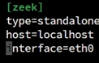

<details>
<summary><b>Examining Zeek’s Subcomponents</b></summary>

## Module Overview
Details Zeek's subcomponents to help with processing within the system and wrap up installation with general configurations and input validation.

### 1. Management and Monitoring Subcomponents
*   **zeekctl:** 
    - An interactive management shell used to help deploy Zeek with new scripts.
*   **Capstats:** 
    - A tool that monitors network interfaces and their usage statistics.
    - Performs analysis on the utilization or saturation of particular links for troubleshooting.
    - Displays interface statistics including packets per second, bandwidth, dropped packets, and data transmitted.
    - Shows packet counts per protocol (such as UDP, TCP, ICMP, and non-IP protocols).

---

## Package Management and Messaging
Tools responsible for managing add-ons and handling internal communication.

### 1. Zeek Package Manager
*   **Package Management:** 
    - A command-line tool that makes it easy to install and manage packages and scripts for Zeek and/or zeekctl.
*   **Default Repository:** 
    - Configured by default to pull packages from a special Git repository containing contributions from various sources.
*   **Security Caution:** 
    - Users should verify code and packages before pulling them to ensure they are safe and properly written.

### 2. Broker
*   **Communication Layer:** 
    - Handles logging and alerting based on events, and manages the distribution to subscribers.
*   **Application Integration:** 
    - Integrates with external applications to receive desired communications in specific formats.
*   **Output Customization:** 
    - Allows fine-tuning of messages from event handlers and customization of available formats.

---

## Additional Native Subcomponents
Other ecosystem tools that add functionality and ease of use.

### 1. General Tools
*   **Auxiliary Subcomponents:** 
    - Includes BinPAC, zeek-aux, BTest, paraglob, and trace-summary.

### 2. PySubnetTree
*   **Subnet Mapping:** 
    - A package that maps CIDR-notation subnets to specific Python objects using longest matching prefix lookups.
*   **Data Organization:** 
    - Allows defining subnets for resources, companies, departments, or other categories to sort data effectively.

</details>

<details>
<summary><b>Configuring Zeek</b></summary>

## Configuration Overview
Finishing the configuration of Zeek by examining the main configuration files and tweaking them for simple network data ingestion and logging.

### 1. Main Configuration Files
*   **Directory Location:** 
    - Located in the installation directory's etc folder (`/opt/zeek/etc`).
*   **The Files:** 
    - Consists of three main files: `networks.cfg`, `node.cfg`, and `zeekctl.cfg`.

### 2. Interface Preparation
*   **Identify the Interface:** 
    - Understand which interface to monitor (in this lab, it is `ens18`). Ensure you check your specific interface name as it may differ.

---

## File Configurations
Modifying the specific files to set up the monitoring environment.

### 1. networks.cfg
*   **Purpose:** 
    - Used to define internal networks or private subnets.
*   **Modifications:** 
    - Added the internal LAN subnet (`192.168.30.0`) so Zeek understands it as an owned internal network.

### 2. node.cfg
*   **Purpose:** 
    - Allows defining the deployment type (e.g., standalone), host name, and interface name.
*   **Modifications:** 
    - Changed the interface name to `ens18` to designate where monitoring occurs.
*   **Cluster Components:** 
    - Loggers, managers, proxies, and workers are utilized for clustered deployments but are not needed for this standalone setup.

### 3. zeekctl.cfg
*   **Purpose:** 
    - Specifies parameters for Zeek management functionality (the management piece for the entire Zeek ecosystem).
*   **Parameters Included:** 
    - Destinations for alerting/mail, space availability, log rotation schedules, directory locations, and file extraction settings. (No modifications were made here).

---

## Deployment and Troubleshooting
Deploying the configuration and resolving startup issues.

### 1. Initial Deployment Error
*   **The Crash:** 
    - Running the `zeekctl deploy` command initially caused Zeek to crash.
*   **Log Investigation:** 
    - Checked the logs located in `/opt/zeek/logs/current`.
*   **The Issue:** 
    - The Zeek application lacked permissions to run a pcap and utilize the interface for captures.

### 2. Resolution and Verification
*   **Applying the Fix:** 
    - Corrected the interface permissions issue.
*   **Redeploying:** 
    - Ran the `zeekctl deploy` command again. (An error regarding a missing SMTP server for mail appeared, but this is acceptable).
*   **Checking Status:** 
    - Zeek started successfully. Ran the status command to verify it is running.

### Installation Configuration

```bash
ls -la /opt/zeek
ls -la /opt/zeek/etc
#check the interface name (in this case eth0)
sudo nano /opt/zeek/etc/networks.cfg # look for the network configuration file
#put your internet lan subnet /gateway
sudo nano /opt/zeek/etc/node.cfg

# Example; change the interface to yours
#save and exit
sudo nano /opt/zeek/etc/zeekctl.cfg #zeek control configuration file
# save if you cant find anything

zeekctl deploy

#if it crashed check: 
zeekctl status
cat /opt/zeek/logs/current/stderr.log

#if you cant modify the pcap of the interface:
sudo setcap cap_net_raw,cap_net_admin=eip /opt/zeek/bin/zeek
#deploy
zeekctl deploy
# or
sudo /opt/zeek/bin/zeekctl deploy 
# or
/opt/zeek/bin/zeekctl 

#should show "stating zeek..."

```

</details>

<details>
<summary><b>Validating Zeek</b></summary>

## Overview
Validating Zeek's data analysis on live network streams and testing ingestion of sample PCAP files.

### 1. Verification Setup
*   **Service Status:** 
    - Check the status to confirm Zeek is running.
*   **Log Directory:** 
    - Navigate to the logs in the `current` folder to view generated events.

---

## Log Analysis and Troubleshooting
Examining generated logs to verify traffic processing and addressing anomalies.

### 1. Core Log Files
*   **conn.log:** 
    - Displays connections, showing source and destination IP addresses, ports, protocols, and connection details.
*   **weird.log:** 
    - Tracks unclassified activity outside the normal realm of a protocol.
*   **stats.log:** 
    - Displays statistics regarding data ingestion and overall system performance.

### 2. Handling Bad Checksums
*   **The Issue:** 
    - Running in a virtual machine can produce `bad_TCP_checksum` notices because Zeek may not see the full conversation.
*   **The Solution:** 
    - Create a `.zeek` script configured to ignore any event named `bad_TCP_checksum`.
    - Redeploy Zeek using `zeekctl deploy` to apply the script and stop the notifications.

---

## PCAP File Ingestion
Testing Zeek's ability to analyze offline packet capture files.

### 1. Running Offline PCAPs
*   **Sample Acquisition:** 
    - Download a sample file (such as `http.pcap`) using `wget`.
*   **Execution:** 
    - Run `zeek -r <pcap_file> -C` to read and analyze the capture file offline.

### 2. Output Verification
*   **http.log:** 
    - Shows HTTP conversation details extracted from the PCAP.
*   **files.log:** 
    - Confirms file transmissions (such as plain text files) detected within the captured traffic.

### Configurations

```bash
# Enter zeek 

/opt/zeek/bin/zeekctl

status
#check the connection logs
cat /opt/zeek/logs/current/conn.log
# any activity that is outside of the abnormal real of the activity 
cat /opt/zeek/logs/current/weird.log
#if there are checksums; create a tcp file
sudo nano /opt/zeek/share/zeek/site/ignore_bad_checksum.zeek
# input
event weird(name: string, id: conn_id, info: string){
    if(name == "bad_TCP_checksum"){
        # Drop if silently, do nothing
        return;
    }

    # Call the default weird handler
    event weird(name,id,info);
}

# reset zeek
sudo zeekctl deploy

wget https://wiki.wireshark.org/uploads/__moin_import__/attachments/SampleCaptures/tcp-ecn-sample.pcap
#or
curl -o http.pcap [https://raw.githubusercontent.com/zeek/zeek/master/testing/btest/Traces/http/get.pcap](https://raw.githubusercontent.com/zeek/zeek/master/testing/btest/Traces/http/get.pcap)

ls #check files
sudo zeek -r tcp-ecn-sample.pcap -C
ls #check logs
cat http.log #various conversions
cat files.log #if files were transmitted back and forth
```

</details>

<details>
<summary><b>Course Summary</b></summary>

## zeek documentation
https://docs.zeek.org/en/current/

## Course Wrap-Up and Review
Reviewing key concepts covered throughout the course after configuring and validating Zeek with real data.

### 1. Engine and Processing Models
*   **Three Processing Aspects:** 
    - Event generation, event handling, and logging work together to gather data, act on data, or provide insights about the data.

### 2. The Logging Framework
*   **Data Management:** 
    - Manages the collection and storage of log data generated by Zeek.
*   **Customization and Subcomponents:** 
    - Uses three main subcomponents: streams, filters, and writers.
    - Highly customizable with support for exporting data in multiple formats, such as JSON and ASCII.

### 3. Extensibility and Expansion
*   **Plug-ins and Extensions:** 
    - Plug-ins expand Zeek's core functionality.
    - Extensions allow the creation of custom scripts and modules to support additional use cases and increase platform extensibility.

---

## Looking Ahead
Transitioning from the basic overview and installation to advanced topics.

### 1. Future Learning
*   **Documentation and Skill Path:** 
    - Additional details are available in the Zeek documentation.
    - Upcoming courses in the skill path will cover extended use cases, functions, and advanced configurations in greater depth.

</details>