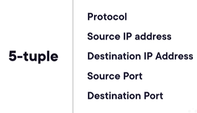
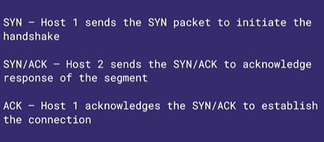
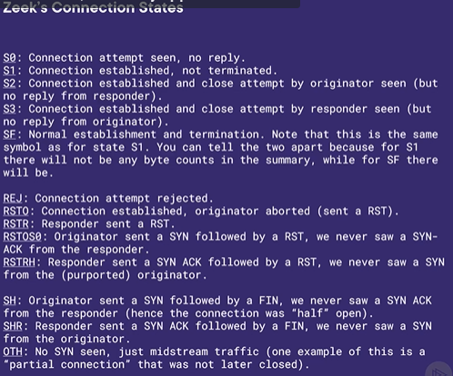

<b>Understanding Network Connections</b>

## Connection Events in Zeek
How Zeek processes and classifies individual network conversations.

### 1. Event-Driven Tracking
*   **Connection Events:** 
    - Zeek outputs a "connection event" for every connection it observes on the network.
    - These events feed crucial baseline information into the various protocol analyzers.
*   **Metadata Captured:** 
    - Each event documents detailed network flow elements, including the 5-tuple components, protocol, connection duration, and the TCP connection state.

    

---

## Event Mechanics and Tracing
The internal mechanisms Zeek uses to tag, track, and manage network traffic states.

### 1. Unique Identifiers (UIDs)
*   **Traffic Tagging:** 
    - Zeek assigns a UID to each connection to track related activity.
    - UIDs allow analysts to correlate related flows, which is essential for identifying attackers attempting to hide malicious traffic using long-tail flows.

### 2. Event Types
*   **State Management:** 
    - Zeek uses specific event definitions—such as `new_connection`, `connection_state_remove`, and `connection_timeout`—to determine how to handle connection states and process the resulting information.

---

## Security and TCP Analysis
Monitoring the physical mechanics of network communication to spot anomalies.

### 1. Three-Way Handshake Monitoring
*   **Tracking the Exchange:** 
    - Zeek actively tracks all phases of the TCP three-way handshake.
*   **Detecting Anomalies:** 
    - It can identify and alert on irregular behaviors, such as a handshake failing to complete or a host making repeated attempts to initiate a connection without finishing prior ones.

    

<b>Interpreting Zeek Connection Sessions</b>

## Reverting Log Formats for Parsing
Transitioning from JSON back to the native TSV (Tab-Separated Values) format to leverage `zeek-cut` for streamlined, single-line session analysis.

### 1. Modifying the Configuration
*   **Editing `local.zeek`:** 
    - Navigate to the local site scripts directory (e.g., `share/zeek/site/local.zeek`).
    - Comment out the previously added JSON policy line to disable it.
*   **Applying Changes:** 
    - Save the script and redeploy Zeek. Logs will revert to the default `zeek.tsv` format.
*   **Why TSV?:** 
    - While JSON is highly structured, reverting to TSV allows `zeek-cut` to display multiple specified fields cleanly across a single line, which can make interpreting bulk connection sessions easier at a glance.

---

## Analyzing Connection States and Data
Extracting specific fields from `conn.log` to build a complete story of a network session and detect potential anomalies.

### 1. Basic Connection Tracking
*   **Core Identifiers:** 
    - Running `zeek-cut` to extract `uid`, `id.orig_h` (source IP), `id.resp_h` (destination IP), and `service` provides the baseline identities for each connection event.

### 2. Deepening the Context
*   **Connection State (`conn_state`):** 
    - Adding this field reveals the specific status of the TCP handshake and session.
    - **`S0`:** Indicates a connection attempt was seen, but no reply was received.
    - **`SF`:** Indicates a normal connection establishment and successful termination.
*   **Duration and Byte Counts:** 
    - Adding `duration`, `orig_bytes`, and `resp_bytes` shows exactly how long a connection lasted and the volume of information transferred back and forth.
*   **Anomaly Detection:** 
    - Reviewing data volumes alongside specific services can highlight suspicious behavior. For example, exceptionally high byte counts on a per-connection basis for DNS requests could indicate DNS tunneling.

<b>Searching Alternate Data Streams</b>

## The Concept of Alternate Data Streams (ADS)
Understanding how specific file system behaviors intersect with network analysis.

### What is an ADS?
*   **File System Behavior:** An ADS is a feature primarily associated with Windows environments, originally intended for forking files, and is created by appending a colon to a file name.
*   **Hidden by Default:** These streams are designed to be invisible to typical operating system file explorer searches.
*   **A Dual-Edged Sword:** While the hidden nature of an ADS is useful for standard backend storage functions, it makes the feature highly attractive to malicious actors.

---

## Security Implications of ADS
How threat actors exploit hidden file streams to bypass endpoint defenses.

### 1. Malicious Use Cases
*   **Hiding Malware:** Attackers can conceal malicious code directly within an ADS to evade standard endpoint detection tools.
*   **Staging Exfiltration:** The hidden streams can be used to silently aggregate and stage gathered information before moving it out of the network.
*   **Long-Tail Exfiltration:** Attackers frequently pair hidden ADS staging with low-and-slow, long-tail network connections to exfiltrate data without triggering immediate volume-based alarms.

---

## Detecting ADS Activity with Zeek
Leveraging network visibility to uncover threats operating at the endpoint level.

### 1. The Network Footprint
*   **Indirect Detection:** Zeek operates at the network layer and cannot directly search an endpoint's local file system for an ADS without an additional agent installed.
*   **Traffic Correlation:** Zeek is highly effective at detecting the inevitable network activity resulting from malicious ADS usage, such as malware phoning home or the slow exfiltration of data.
*   **Combining Capabilities:** By actively correlating Zeek's detection of anomalous file transfers, suspicious DNS queries, and long-tail connection flows, analysts can piece together the broader incident surrounding the hidden stream.

<b>Detailing Connection State</b>

## Connection States Overview
Connection states provide critical context regarding the status of a network flow, and they are primarily applicable to TCP since UDP is connectionless.

### 1. Common TCP States
*   **SF:** Indicates a normal connection establishment and a successful termination.
*   **S0, S1, S2:** Represent connections at various stages of establishment, from not receiving any reply (S0) to establishing but not terminating normally.
*   **REJ:** Indicates that a connection attempt was explicitly rejected.
*   **RSTO and RSTR:** Represent connection resets where either the originator (RSTO) or the responder (RSTR) aborted the connection. 
*   **RSTRH:** Indicates the responder sent a SYN-ACK, but it was immediately followed by a reset packet (no returning SYN was seen). This state is highly useful for detecting TCP half-open connections or potential DDoS attacks.
*   **State 146:** Indicates that no SYN packets were actually seen in the flow. This could point to abnormal activity, or it might just mean Zeek began capturing the traffic midstream.

---

## Analyzing States with zeek-cut
Using parsing tools to filter out unwanted information and correlate connection statuses with specific endpoints.

### 1. Filtering and Correlation Strategies
*   **Isolating State Counts:** Running `zeek-cut` strictly on the `conn_state` field and sorting by unique counts provides a high-level summary of the overall network health and flow types.
*   **Endpoint Mapping:** Combining `conn_state` with `id.orig_h` (source IP) and `id.resp_h` (destination IP) creates a line-by-line view of exactly who is communicating and how the connection is behaving.
*   **Targeted Grepping:** Piping the output to `grep` for a specific state, such as `S0`, quickly reveals anomalous hosts that are repeatedly transmitting packets without ever completing the three-way handshake.
*   **Port Diagnostics:** Adding the originating and responding ports to the query can help diagnose specific infrastructure issues, such as broken traffic inspection or asynchronous routing repeatedly failing over a specific port (like 8443).

<b>Deeper Network Analysis with Zeek</b>

## Course Review and Summary
A retrospective on the foundational concepts and workflows covered throughout the course.

### 1. Key Topics Covered
*   **Log Exploration and Parsing:** 
    - Investigating Zeek's default and structured log files using utilities like `zeek-cut` and `jq` to parse, filter, and format output.
*   **Anomaly Detection:** 
    - Using network analysis techniques to uncover port/protocol mismatches, unnatural communication patterns, and long-tail anomalies.
*   **Network Streams and Connection Events:** 
    - Examining connection events, tracking UIDs, and interpreting TCP connection states to understand the full lifecycle of network flows.

---

## Operational Role and Continued Learning
How Zeek fits into broader security operations and resources for advancing your skills.

### 1. Zeek in Security Operations
*   **Deployment Flexibility:** 
    - Capable of analyzing live network streams in real time or ingesting recorded PCAPs for retrospective analysis.
*   **Operational Integration:** 
    - Can serve as the central foundation or an enhancement to an organization's existing network and security toolset.

### 2. Recommended Practice and Reference Resources
*   **Official Zeek Documentation:** 
    - Comprehensive guide for syntax, built-in frameworks, analyzers, and deep customization to meet organizational needs.
*   **try.zeek.org:** 
    - An interactive environment designed to test scripts, practice commands, and explore Zeek capabilities hands-on.
*   **Next Steps:** 
    - Continuing through the skill path to explore advanced use cases, custom scripting, and deeper framework integrations.

