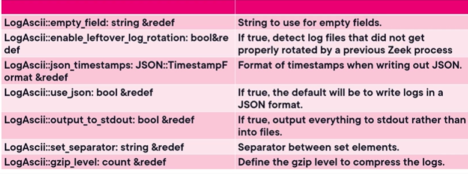
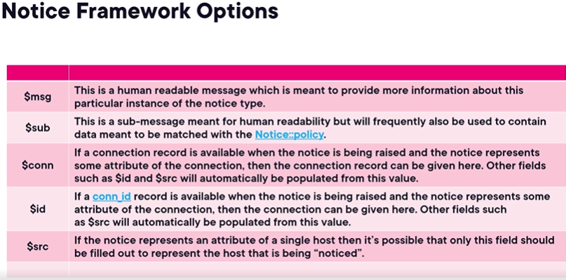
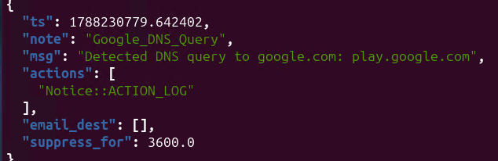

<details>
<summary><b>Managing Events with Frameworks</b></summary>

## The Logging Framework Overview
An introduction to how Zeek handles log output and structure.

### 1. Framework Characteristics
*   **Flexible Structure:** Zeek utilizes a highly flexible, key-value pair-based approach for logging.
*   **Event-Driven:** Any neutral or notable event that occurs on the network typically gets logged for additional analysis, monitoring, alerting, or record keeping.
*   **Extensibility:** The framework can be easily extended through various modules and integrations to fit specific organizational needs.

---

## Core Components of the Logging Interface
The logging framework relies on three interdependent components to function: Streams, Filters, and Writers.

### 1. Log Streams
*   **Definition:** The individual logs that Zeek maintains (e.g., the DNS stream or `weird.log`).
*   **Structure:** Each stream contains definitions for the specific fields that the resulting log will consist of.

### 2. Log Filters
*   **Function:** Determine exactly *what* information gets written to the logs and *how* it is handled (e.g., output destination, log rotation intervals).
*   **Default Behavior:** Every log stream has a default filter built-in that writes everything to disk. 
*   **Dependency:** If a log stream has no filters attached to it, it will not log anything. Custom filters can be added to refine this behavior.

### 3. Log Writers
*   **Function:** Attached to filters, writers define the output format and tell Zeek how to actually write the events.
*   **Formats:** The default format is ASCII, but writers can extend output to databases or platforms like Elasticsearch.
*   **Metadata:** Writers typically include metadata describing the file path, format, and other variables, which is useful for other Zeek processes.

</details>

<details>
<summary><b>Zeek Base and Policy Scripts</b></summary>

## Comparing Base and Policy Scripts
Understanding the architectural division of responsibility between base and policy scripts.

### 1. Functional Roles
*   **Base Scripts (`base/`):** 
    - Define what Zeek sees, how it ingests data, and how it logs network activity.
    - Responsible for analyzing raw packets, tracking requests, replies, headers, and messages, and writing standard logs.
*   **Policy Scripts (`policy/`):** 
    - Define how Zeek reacts to the data analyzed by the base scripts.
    - Responsible for raising notices, triggering alerts, performing policy actions (e.g., drops), and generating detections for security events, traffic spikes, and anomalous behaviors.

---

## Signatures and Protocol Detections
How policy scripts and signatures build on base protocol analysis.

### 1. Web Application Detection Example
*   **Base Layer:** The base HTTP scripts ingest and analyze HTTP packets (tracking headers, payload bodies, and session states).
*   **Policy Layer (`detect-webapps`):** Uses signatures (`.sig` files) rather than standard scripts to inspect fields like `http-reply-body`, response headers, and metadata.
*   **Detection Matching:** Matches specific web application signatures (e.g., Redmine, TYPO3, Plesk, Moodle, Google Analytics) and generates events when matches are found.

---

## Frameworks in Base vs. Policy
How frameworks operate at both layers of the Zeek hierarchy.

### 1. Base Frameworks
*   **Spicy Framework:** Acts as a customization and parser engine.
*   **Signature Framework:** Enables custom signature-based pattern matching.
*   **Notice Framework (Base):** Defines how notice records are created, populating fields such as MIME types, file information, and UIDs.

### 2. Policy Frameworks and Actions
*   **Policy-Level Notice Framework:** Implements actionable responses (e.g., dropping packets) via hooks.
*   **Inter-Framework Integration:** Interacts with frameworks like `NetControl` to manage actions such as catch-and-release or active blocking.
*   **Miscellaneous Policies (`policy/misc/`):** Contains diverse detections that expand beyond base capabilities to capture anomalous network behaviors.

</details>

<details>
<summary><b>Using the Logging Framework</b></summary>

## Logging Framework Components
The logging framework is built on three core components: writers, filters, and streams. Understanding how they interact is essential for manipulating Zeek's logging infrastructure.

### 1. Log Writers
*   **Function:** Determine the actual output format of the logs.
*   **Supported Formats:** The **ASCII writer** is the most common (and can be converted to JSON). Zeek also natively supports **SQLite** and integrations for platforms like **Elasticsearch**.
*   **Customization:** Writers are rarely modified directly unless a specific output format is required. However, they offer built-in options (detailed in the *Book of Zeek*) for formatting timestamps, writing natively in JSON, and detecting un-rotated logs.



> more files at docs.zeek.org
---

### 2. Log Filters
*   **Function:** Define the exact parameters of what a stream will log and how it will be handled.
*   **Dependency:** A stream can have multiple filters attached, but if a stream has **no filters**, it will not write any output.
*   **Default Behavior:** Upon creation, streams are assigned a default filter (simply named `default`) that logs everything.
*   **Capabilities:** Filters can be customized globally or individually to:
    - Rename logs or change the output file path.
    - Send log output to multiple files simultaneously.
    - Define and manage log rotation processes.
    - Add new fields, or rewrite/rename existing columns in the final Zeek log output.

---

### 3. Log Streams
*   **Function:** The primary component used to create entirely new logs or modify the output of built-in logs.
*   **Requirements:** Creating a new stream requires defining a **record type** (which explicitly lists all the fields that will be logged) and a **log ID** (which uniquely identifies the stream).
*   **Execution:** Streams use attributes like `create_stream` to initialize the log and `write` to actively record the data.
*   **Event Driven:** To function properly, streams must be tied to specific events (either built-in global events or custom ones) to trigger the log generation.
*   **Optimization:** Streams can be entirely disabled if they are no longer needed, which can help optimize system performance.

</details>

<details>
<summary><b>Interacting with the Zeek Notice Framework</b></summary>

## Notice Framework Actions
The Notice Framework allows you to define specific actions to take when Zeek flags an event, bridging the gap between detection and reporting. 
*   **ACTION_LOG:** Writes the notice directly into the `Notice::LOG` logging stream (typically `notice.log`).
*   **ACTION_ALARM:** Writes to the `Notice::ALARM_LOG` stream (which rotates hourly) and emails the contents to the configured destination.
*   **ACTION_EMAIL:** Sends the notice immediately in an email to the configured addresses.
*   **ACTION_PAGE:** Sends a high-priority alert page or email to designated recipients.

## Customizing with Hooks and Policies
You can tailor the framework's behavior using policies, hooks, and specific record types to ensure you only receive the alerts that matter.
*   **Notice Policies:** Act as filters to determine which flagged situations are actionable and what specific actions to apply to them.

*   **Policy Hooks:** Multi-bodied functions used to modify notices—such as appending payload data or connection IDs—before they are sent onward to the action plugins.
*   **Prioritization:** Multiple policy hooks can have priorities applied to dictate their execution order (greater values execute first).
*   **The `Notice::Info` Record:** The primary record type that contains the context of the event (like message strings and sources) and is passed to the `NOTICE` function.
*   **Suppression:** Notices can be suppressed utilizing the `identifier` field in the `Notice::Info` record to prevent alert fatigue from repetitive events.

## Scripting Demo: SSH Brute Force Detection
A custom script can leverage the Notice Framework to actively track and alert on SSH brute-force attempts across the network.
1.  **Load Dependencies:** Import the Notice framework and the base SSH protocol analyzer at the top of the script.
2.  **Define Notice Type:** Create a custom `Notice::Type` (e.g., `SSH_Brute_Force`).
3.  **Track Attempts:** Build an event handler that increments an attempt counter for both successful and failed SSH authentications originating from a specific source IP.
4.  **Trigger Notice:** Use an `if` statement to evaluate the count; if the attempt counter exceeds a threshold (like 5), trigger the custom notice.
5.  **Deploy:** Append the `@load` statement to `local.zeek`, verify the configuration with `zeekctl check`, and apply the changes with `zeekctl deploy`.

```bash
# Helps detect ssh bruteforce activity
cd /opt/zeek/share/zeek/site 
ll
# create detect bruteforce file
nano detect_bruteforce_ssh.zeek

@load base/frameworks/notice
@load base/protocols/ssh

redef enum Notice::Type += { SSH_Brute_Force };
global ssh_attempts: table[addr] of count &default =0;

event ssh_auth_attempt(c:connection, success:bool)
{
    if (!success)
    #if the ssh attempt is successfull
    {
        #increment the ssh attempt count
        ssh_attempts[c$id$orig_h] += 1;

        #if it is more the 5 notify that it is a brute force attack
        if (ssh_attempts[c$id$orig_h] > 5)
        {
            NOTICE([
                $note=SSH_Brute_Force,
                $msg=fmt("Excessive failed SSH attempts from %s", c$id$orig_h),
                $conn=c
            ]);
        }
    }
}

#save and enter
# edit the local.zeek
nano local.zeek

@load ./detect_bruteforce_ssh
# check if there are no errors on the script
sudo /opt/zeek/bin/zeekctl check
sudo zeekctl deploy

#check logs
jq . /opt/zeek/logs/current/notice.log

```

</details>

<details>
<summary><b>Monitoring DNS with Zeek</b></summary>

## DNS Monitoring Overview
Using Zeek to inspect, track, and alert on DNS queries and responses across the network.

### 1. Capabilities and Use Cases
*   **Deep Inspection:** 
    - Zeek allows inspection inside DNS queries and responses for specific domains, record types, or metadata.
*   **Enforcing DNS Policies:** 
    - Can trigger Notice Framework actions if endpoints communicate with unauthorized external DNS servers.
*   **Threat Detection & Intelligence:** 
    - Enables domain blocking or alerting by comparing queries against known malicious domains, blocklists, or threat intelligence feeds.

---

## Creating the Custom DNS Monitor Script
Building `dns_monitor.zeek` in the site directory to alert on specific domain queries.

### 1. Script Logic and Construction
*   **Loading Dependencies:** 
    - Loads the base DNS protocol analyzer.
*   **Custom Notice Type:** 
    - Redefines `Notice::Type` to include a custom alert type (e.g., for Google DNS queries).
*   **Event Handling:** 
    - Inspects the `query` field inside the DNS event handler to check for specific string patterns (such as `google.com`).

---

## Deploying and Verifying Zeek DNS Analyzers
Confirming analyzer states, loading custom scripts, and testing detections.

### 1. Checking Active DNS Events
*   **Inspecting Built-in Events:** 
    - Running the `zeek` binary with the `-NN` flag and piping to `grep` for `DNS` displays currently enabled analyzers and events (e.g., DNS content analyzer, DNS keys, cookies, and keepalives).
*   **Loading and Deploying:** 
    - Add `@load dns_monitor` into `local.zeek`.
    - Deploy the updated configuration via Zeek management tools.

### 2. Generating Traffic and Log Verification
*   **Generating Test Queries:** 
    - Running commands like `nslookup google.com` generates actual DNS query traffic for Zeek to inspect.
*   **Log Analysis:** 
    - The triggered event is logged to `notice.log` and can be formatted with `jq`.
*   **Subdomain Matching:** 
    - String-based matching triggers on full domain trees (e.g., queries for `calendar.google.com` will match a `google.com` pattern).

---

## Production Considerations
*   **Tuning and Noise Reduction:** 
    - Broad domain rules (like matching `google.com`) generate high noise and are not suitable for production monitoring.
*   **Targeted Matching:** 
    - Real-world detections should target specific malicious domains (e.g., `internetbaddguys.com`), high-risk TLDs, destination lists, or integrated threat intelligence sources.

```bash
# Helps detect DNS activity
cd /opt/zeek/share/zeek/site 

# create detect bruteforce file
nano dns_monitor.zeek

@load base/protocols/dns

redef enum Notice::Type += { Google_DNS_Query };

event DNS::log_dns(rec: DNS::Info)
{
    ## Check if there is a google query
    if (rec?$query && /google\.com$/ in rec$query)
    {
        NOTICE([
            $note = Google_DNS_Query,
            $msg = fmt("Detected DNS query to google.com: %s", rec$query)
        ]);
    }
}

#save and enter
# edit the local.zeek
nano local.zeek

@load ./dns_monitor
# able to see what dns type of events
sudo /opt/zeek/bin/zeek -NN | grep DNS


# check if there are no errors on the script
sudo /opt/zeek/bin/zeekctl check
sudo zeekctl deploy
#detetion will happen if zeek sees dns come through
#check logs
jq . /opt/zeek/logs/current/notice.log
```

</details>
