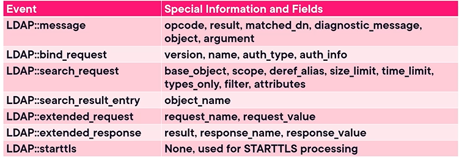

Integrating Zeek with Identity and email

## Integrating Zeek

1. Identity Providers
2. Email and Domain Providers
3. The network
- help you start knowing about the network environment

Zeek's Domain Monitoring Uses

## Protocol Analyzers
### LDAP
- Common protocol used in domain protocol
- We can monitor it using zeek

### Email
- 

<b>🏢 Zeek’s Domain Monitoring Uses (On-Premises)</b>

### The Power of On-Premises Protocol Analysis
While Zeek can integrate with cloud environments, its foundational strength lies in on-premises network analysis. Zeek leverages specialized protocol analyzers to monitor and secure critical domain infrastructure.

### Key Domain Protocol Analyzers
* **Directory Services (LDAP):** 
  Zeek features a dedicated LDAP analyzer that generates specific events to monitor directory lookups, modifications, and domain environment queries.
* **Email Infrastructure:** 
  For organizations running on-premises email, Zeek provides native protocol analyzers for **SMTP**, **POP**, and **IMAP** traffic.
* **Authentication Mechanisms:** 
  Analyzes **Kerberos**, **NTLM**, and **NetBIOS** communications. It extracts critical field-value pairs to track identity and domain-related authentication traffic.
* **Remote Access & Administration:** 
  * Monitors **RDP**, **SSH**, and **Telnet**. 
  * *Contextual Detection:* When Zeek detects remote access (like RDP), it can trigger events to gather identity context—identifying exactly *who* is logging in and from *where*—to immediately flag suspicious administrative behavior.
* **Domain File Sharing:** 
  Tracks data movement via **Samba (SMB)**, **NFS**, and **FTP**. By monitoring these protocols, Zeek can record exactly who is pulling files from, or uploading files to, sensitive domain file shares.
* **Core Network Services:** 
  Maintains deep visibility into foundational infrastructure protocols like **DNS** and **DHCP**.

### Expanding the Perimeter
With comprehensive coverage of on-premises domain data transmissions, Zeek provides a robust baseline for network security. The next logical step is learning how to extend this deep visibility and identity correlation into external cloud services, such as Microsoft Cloud environments.

<b>Seeing Zeek Domain Analyzers</b>

## Visibility and the Decryption Challenge
To effectively monitor a domain, Zeek must be able to inspect the traffic. Modern environments frequently encrypt this data, presenting a challenge for network security monitors.

### 1. The Problem with Encrypted Traffic
*   **Secure Protocols:** 
    - Many Active Directory environments now default to secure protocols (like Secure LDAP/LDAPS) rather than transmitting data in plaintext.
*   **The Visibility Gap:** 
    - If Zeek cannot see inside the payload, traditional string-matching and deep protocol analysis will fail.

### 2. The Solutions
*   **Active Decryption:** 
    - Traffic must be decrypted (e.g., via a middlebox or decryption broker) before being handed to Zeek to gain full visibility and extract field-value pairs from protocols like HTTPS.
*   **Fingerprinting & Threat Intel:** 
    - If decryption is not possible, Zeek can utilize TLS fingerprinting combined with external Threat Intelligence feeds to identify known-malicious encrypted connections without reading the payload.

---

## Domain Protocol Coverage & Alerting
Zeek provides native analyzers for a wide array of protocols commonly found in domain environments. These are typically enabled and configured within the `local.zeek` script.

### 1. Key Monitored Protocols
*   **File & Directory Services:** 
    - Monitors traffic for NetBIOS, Samba (SMB), and NFS.
*   **Email Services:** 
    - Analyzes SMTP, POP3, and IMAP.
*   **Core Network:** 
    - Maintains deep visibility into DNS, DHCP, and NTP.
*   **Active Alerting:** 
    - Zeek can be configured to actively use your local SMTP server to send out email alerts via the Notice Framework.

---

## SIEM Integration and Data Correlation
While Zeek generates powerful localized logs, integrating those logs into a SIEM platform like Splunk unlocks advanced hunting capabilities.

### 1. Analyzing Traffic in Splunk
*   **Log Ingestion:** 
    - Zeek logs (like `conn.log` or protocol-specific logs) are forwarded and ingested into the SIEM.
*   **Hunting for Anomalies:** 
    - Analysts can search for specific responding ports and filter by "rare values" to identify misconfigured devices or rogue domain traffic (like unexpected SMB broadcasts on unauthorized subnets).

---

## Defense in Depth: The Zeek Agent
Network traffic only tells half the story. To achieve true Defense in Depth, network telemetry must be correlated with endpoint activity.

### 1. Bridging Network and Endpoint
*   **What is it?** 
    - The Zeek Agent is an endpoint service installed directly on host operating systems (such as Windows Domain Controllers or Linux servers).
*   **How it works:** 
    - Instead of just observing packets, the agent sends host-level telemetry (e.g., registry key modifications, user logins, and newly spawned processes) directly back to the Zeek system.
*   **The Result:** 
    - When Zeek detects a suspicious connection on the network, the Zeek Agent provides the exact user account and process ID involved, instantly completing the context of the incident.

<b>Using Zeek with Microsoft 365 and Azure</b>

## Cloud Deployment Realities
Deploying Zeek in a cloud environment (like Azure VNETs or AWS VPCs) presents different challenges compared to on-premises deployments.

### 1. The Cloud Visibility Gap
*   **Different Environments:** 
    - Zeek does not operate exactly the same in the cloud as it does on-premises. While protocol analyzers still work, native cloud traffic routing makes capturing the data more complex.
*   **The Need for Integrations:** 
    - To get the full benefit of Zeek in the cloud, it must typically be combined with other tools, XDR platforms (like Cisco XDR), and native cloud integrations.

---

## Microsoft Defender Integration
To bridge the gap between traditional network monitoring and modern cloud endpoint security, Zeek integrates directly with Microsoft's ecosystem.

### 1. The Native Zeek Agent
*   **Built-in Capabilities:** 
    - Through a strategic partnership, a modified version of the Zeek agent ships natively with Microsoft Defender installations.
*   **Seamless Telemetry:** 
    - This allows organizations to utilize Zeek's network visibility directly on Microsoft platforms without having to deploy separate standalone network sensors for every cloud workload.

---

## Microsoft Sentinel and the Content Hub
Leveraging Zeek telemetry within Microsoft's centralized security operations tools.

### 1. Accessing Zeek Parsers
*   **The Content Hub:** 
    - Within the Defender portal (and Microsoft Sentinel), administrators can search for Zeek and Corelight content.
*   **Corelight Parsers:** 
    - These integrations provide custom parsers that allow Microsoft Sentinel to ingest and properly format Zeek data (covering protocols like NTLM, HTTP, ICMP, and even Suricata IPS alerts).

### 2. Streamlining SOC Operations
*   **File-Sharing Visibility:** 
    - These parsers are highly effective for monitoring common business file-sharing protocols (like NFS, FTP, and SFTP) directly within the Microsoft cloud environment.
*   **Custom Rules:** 
    - Security Operations Centers (SOCs) can use this parsed Zeek telemetry to write custom detection rules, bringing deep network visibility directly into their main cloud dashboards.

<b>Finishing up Domain Deployments</b>

## Module Wrap-Up and Key Takeaways
A summary of Zeek's capabilities within domain environments and a look ahead at incident response methodologies.

### 1. Comprehensive Domain Visibility
*   **Protocol Analysis:** 
    - Zeek provides deep visibility into critical domain protocols such as LDAP, Kerberos, and various file-sharing services.
*   **Custom Detections:** 
    - Security teams can build highly specific detections based on the events generated by these native analyzers to monitor business-critical infrastructure.

### 2. The Power of Endpoint Correlation
*   **Native Integrations:** 
    - Platforms like Microsoft Defender now include Zeek natively, seamlessly bridging the gap between network and endpoint security.
*   **Enhanced Context:** 
    - By correlating network traffic with endpoint telemetry (like specific processes and user identities), analysts gain a complete, actionable picture of domain activity.

---

## Up Next: Simulated Attack and Incident Response
*   **The Scenario:** 
    - The upcoming module transitions from configuration to active defense by simulating a network attack.
*   **Pure Zeek Analysis:** 
    - The walk-through will focus entirely on Zeek's native capabilities for incident response. It will demonstrate how to trace, investigate, and respond to an attack using only Zeek's logs and tools, without relying on external integrations or third-party platforms.

